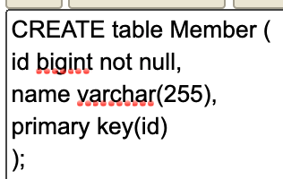
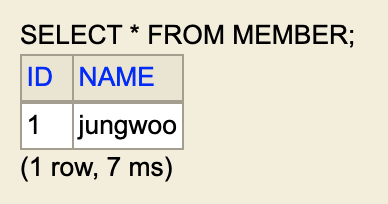
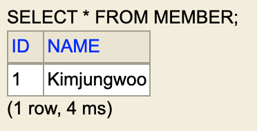
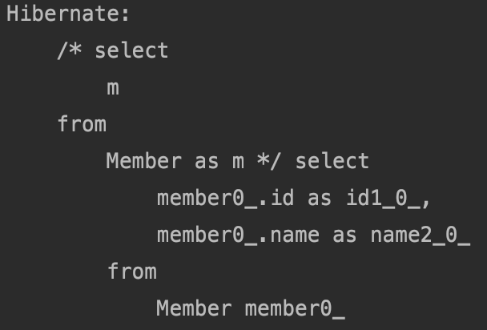

#### JPA 구동 방식

Persistence 클래스로 시작해서 설정 정보 조회를 한다. 

그 다음 EntityManagerFactory 클래스 생성한다.

필요할 때마다 EntityManager를 만들어서 실행.


```java
package hellojpa;

import javax.persistence.EntityManager;
import javax.persistence.EntityManagerFactory;
import javax.persistence.Persistence;

public class JpaMain {

    public static void main(String[] args) {
        EntityManagerFactory emf = Persistence.createEntityManagerFactory("hello");
        
        EntityManager em = emf.createEntityManager();
        //code
        em.close();
        
        emf.close();
        
    }
}

```




```java
package hellojpa;

import javax.persistence.Entity;
import javax.persistence.Id;

@Entity
public class Member {

    @Id
    private long id;
    private String name;

    public long getId() {
        return id;
    }

    public void setId(long id) {
        this.id = id;
    }

    public String getName() {
        return name;
    }

    public void setName(String name) {
        this.name = name;
    }
}

```

db의 테이블을 지정하고 싶으면 @Table(name = "테이블이름")으로 지정할 수 있다. 

db의 컬럼을 지정하고 싶으면 @Column(name = "컬럼이름")으로 지정 할 수 있다.

```java
package hellojpa;

import javax.persistence.EntityManager;
import javax.persistence.EntityManagerFactory;
import javax.persistence.EntityTransaction;
import javax.persistence.Persistence;

public class JpaMain {

    public static void main(String[] args) {
        EntityManagerFactory emf = Persistence.createEntityManagerFactory("hello");

        EntityManager em = emf.createEntityManager();

        EntityTransaction tx = em.getTransaction();//트랜잭션 생성.
        tx.begin();//트랜잭션 시작.

        Member member = new Member();
        member.setId(1L);
        member.setName("jungwoo");

        em.persist(member);

        tx.commit();//트랜잭션 커밋.
        
        em.close();

        emf.close();

    }
}

```

위는 저장을 보여준다. 

참고로 트랜잭션을 조회말고 다 사용하는 것이 좋으나 수정은 무조건 트랜잭션을 사용해야한다.





정석 코드로 try catch로 짜야한다.

```java
package hellojpa;

import javax.persistence.EntityManager;
import javax.persistence.EntityManagerFactory;
import javax.persistence.EntityTransaction;
import javax.persistence.Persistence;

public class JpaMain {

    public static void main(String[] args) {
        EntityManagerFactory emf = Persistence.createEntityManagerFactory("hello");

        EntityManager em = emf.createEntityManager();

        EntityTransaction tx = em.getTransaction();//트랜잭션 생성.
        tx.begin();//트랜잭션 시작.

        try {
            Member member = new Member();
            member.setId(1L);
            member.setName("jungwoo");

            em.persist(member);

            tx.commit();//트랜잭션 커밋.
        } catch (Exception e) {
            tx.rollback();//롤백
        } finally {
            em.close();
        }
        emf.close();
    }
}

```

이게 정석이지만 실제로는 스프링이 다 해주기 때문에 이렇게 안짜도 된다.

```java
package hellojpa;

import javax.persistence.EntityManager;
import javax.persistence.EntityManagerFactory;
import javax.persistence.EntityTransaction;
import javax.persistence.Persistence;

public class JpaMain {

    public static void main(String[] args) {
        EntityManagerFactory emf = Persistence.createEntityManagerFactory("hello");

        EntityManager em = emf.createEntityManager();

        EntityTransaction tx = em.getTransaction();//트랜잭션 생성.
        tx.begin();//트랜잭션 시작.

        try {
            Member findMember = em.find(Member.class, 1L);
            System.out.println(findMember.getId());
            System.out.println(findMember.getName());
            tx.commit();//트랜잭션 커밋.
        } catch (Exception e) {
            tx.rollback();//롤백
        } finally {
            em.close();
        }

        emf.close();

    }
}

```

조회


```java
package hellojpa;

import javax.persistence.EntityManager;
import javax.persistence.EntityManagerFactory;
import javax.persistence.EntityTransaction;
import javax.persistence.Persistence;

public class JpaMain {

    public static void main(String[] args) {
        EntityManagerFactory emf = Persistence.createEntityManagerFactory("hello");

        EntityManager em = emf.createEntityManager();

        EntityTransaction tx = em.getTransaction();//트랜잭션 생성.
        tx.begin();//트랜잭션 시작.

        try {
            Member findMember = em.find(Member.class, 1L);

            em.remove(findMember);

            tx.commit();//트랜잭션 커밋.
        } catch (Exception e) {
            tx.rollback();//롤백
        } finally {
            em.close();
        }

        emf.close();

    }
}

```

삭제

```java
package hellojpa;

import javax.persistence.EntityManager;
import javax.persistence.EntityManagerFactory;
import javax.persistence.EntityTransaction;
import javax.persistence.Persistence;

public class JpaMain {

    public static void main(String[] args) {
        EntityManagerFactory emf = Persistence.createEntityManagerFactory("hello");

        EntityManager em = emf.createEntityManager();

        EntityTransaction tx = em.getTransaction();//트랜잭션 생성.
        tx.begin();//트랜잭션 시작.

        try {
            Member findMember = em.find(Member.class, 1L);

            findMember.setName("Kimjungwoo");

            tx.commit();//트랜잭션 커밋.
        } catch (Exception e) {
            tx.rollback();//롤백
        } finally {
            em.close();
        }

        emf.close();

    }
}

```

업데이트는 set으로 값만 바꾸면 된다. 따로 persist를 할 필요가 없다. JPA를 통해서 Entity를 가져오면 JPA가 관리하면서 commit하는 시점에서 변경이 되었지 확인을 하고 변경이 되었다면 업데이트 쿼리를 JPA가 날린다.





#### JPQL

```java
package hellojpa;

import javax.persistence.EntityManager;
import javax.persistence.EntityManagerFactory;
import javax.persistence.EntityTransaction;
import javax.persistence.Persistence;
import java.util.List;

public class JpaMain {

    public static void main(String[] args) {
        EntityManagerFactory emf = Persistence.createEntityManagerFactory("hello");

        EntityManager em = emf.createEntityManager();

        EntityTransaction tx = em.getTransaction();//트랜잭션 생성.
        tx.begin();//트랜잭션 시작.

        try {
//            Member findMember = em.find(Member.class, 1L);

            List<Member> result = em.createQuery("select m from Member as m", Member.class)
                    .getResultList();

            for (Member member : result) {
                System.out.println("member.name = " + member.getName());
            }

            tx.commit();//트랜잭션 커밋.
        } catch (Exception e) {
            tx.rollback();//롤백
        } finally {
            em.close();
        }

        emf.close();

    }
}

```

만약 내가 예로 나이가 18살 이상인 회원을 모두 검색하고 싶다면?

그럴 때 사용하는 것이 JPQL이다.

createQuery에 있는 sql의 대상이 테이블이 아닌 객체 Member이다.

JPQL은 지금은 간단히 어떤 것인지만 보고 나중에 다시 포스팅.



필드를 다 가져온다. 멤버 엔티티임을 알 수 있다. 

즉, 객체지향 SQL

