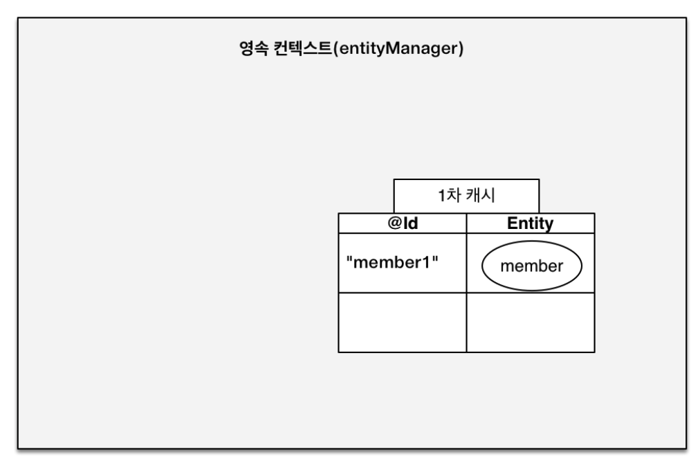
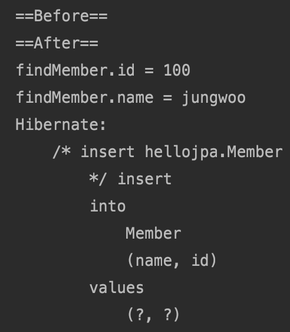
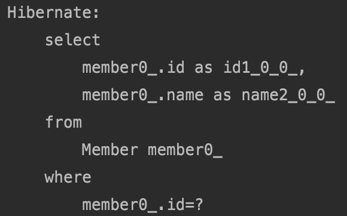
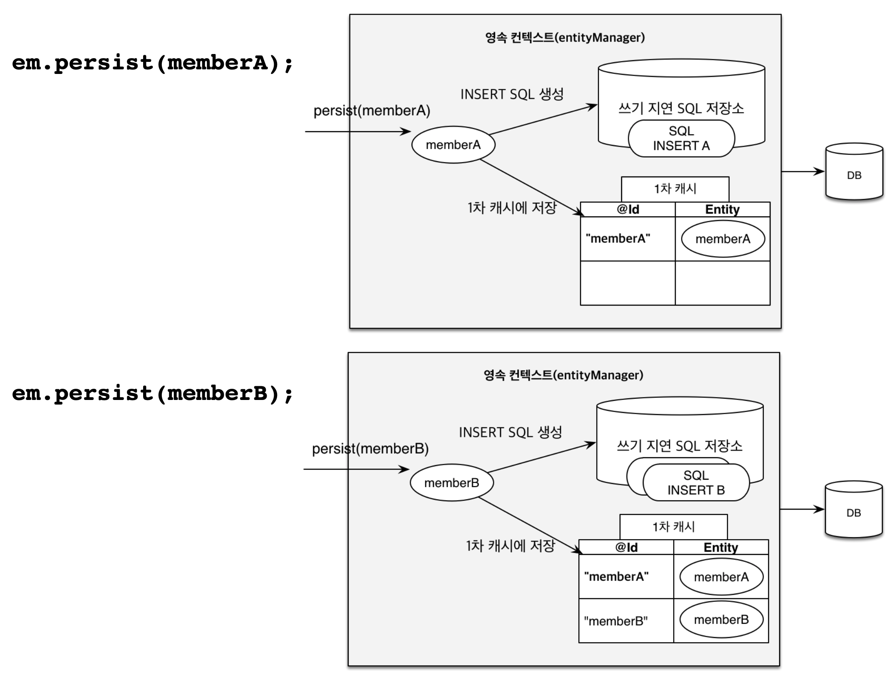
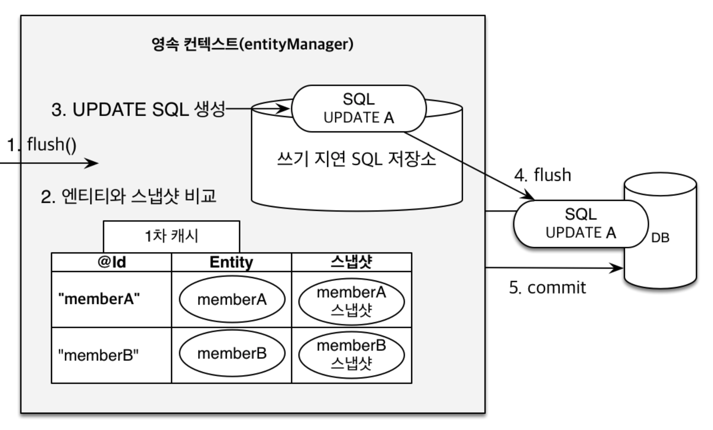

# 영속성 관리


#### JPA에서 가장 중요한 2가지

- 객체와 관계형 데이터베이스 매핑하기(ORM)
- **영속성 컨텍스트**


#### 영속성 컨텍스트

- 엔티티를 영구 저장하는 환경이라는 뜻
- 논리적 개념
- 엔티티 매니저를 통해서 영속성 컨텍스트에 접근
- EntityManager.persist(entity);
  - DB에 저장한다는 것이 아니라 엔티티를 영속성 컨텍스트에 저장한다는 것


#### 엔티티의 생명주기

- **비영속**(new/transient) : 영속성 컨텍스트와 전혀 관계가 없는 **새로운** 상태
- **영속**(managed) : 영속성 컨텍스트에 **관리**되는 상태
- **준영속 (detached)**
 : 영속성 컨텍스트에 저장되었다가 **분리**된 상태
- **삭제 (removed)**
 : **삭제**된 상태


```java
package hellojpa;

import javax.persistence.EntityManager;
import javax.persistence.EntityManagerFactory;
import javax.persistence.EntityTransaction;
import javax.persistence.Persistence;
import java.util.List;

public class JpaMain {

    public static void main(String[] args) {
        EntityManagerFactory emf = Persistence.createEntityManagerFactory("hello");

        EntityManager em = emf.createEntityManager();

        EntityTransaction tx = em.getTransaction();//트랜잭션 생성.
        tx.begin();//트랜잭션 시작.

        try {
                //비영속
                Member member = new Member();
                member.setId(100L);
                member.setName("jungwoo");

                //영속
                em.persist(member);//이때 저장되는 것이 아니다.

            tx.commit();//트랜잭션 커밋.
        } catch (Exception e) {
            tx.rollback();//롤백
        } finally {
            em.close();
        }

        emf.close();

    }
}

```

.persist()하는 순간에 저장되는 것이 아니다.

트랜잭션을 커밋하는 순간에 저장.


#### 영속성 컨텍스트의 이점 - 애플리케이션과 DB사이에 중간계층이 있는 것.

- 1차 캐시
- 동일성(identity) 보장
- 트랜잭션을 지원하는 쓰기 지연
 (transactional write-behind)
- 변경 감지(Dirty Checking)
- 지연 로딩(Lazy Loading)



key에 해당하는 @Id, member1이고 Entity에 해당하는 member객체가 값이다.

em.persist(member);를 하면 우선 1차 캐시에 저장이 되고 바로 아래 라인에서 조회 em.find(member.class, "member1")로 조회를 한다면 1차 캐시에서 조회를 한다.

만약 DB에는 있고 1차 캐시에 없는 member2를 조회한다면 DB에서 조회를하고 1차캐시에 member2를 저장, 후에 member2를 반환한다.

EntityManager라는 것은 보통 DB 트랜잭션 단위로 만들고 트랜잭션이 끝나면 영속성 컨텍스트를 지운다. 그러므로 **1차 캐시**는 큰 이점이 없다.

```java
package hellojpa;

import javax.persistence.EntityManager;
import javax.persistence.EntityManagerFactory;
import javax.persistence.EntityTransaction;
import javax.persistence.Persistence;
import java.util.List;

public class JpaMain {

    public static void main(String[] args) {
        EntityManagerFactory emf = Persistence.createEntityManagerFactory("hello");

        EntityManager em = emf.createEntityManager();

        EntityTransaction tx = em.getTransaction();//트랜잭션 생성.
        tx.begin();//트랜잭션 시작.

        try {
            //비영속
            Member member = new Member();
            member.setId(100L);
            member.setName("jungwoo");

            //영속
            System.out.println("==Before==");
            em.persist(member);//이때 DB 저장되는 것이 아니다. 1차 캐시에 저장
            System.out.println("==After==");

            Member findMember = em.find(Member.class, 100L);//1차 캐시에서 조회

            System.out.println("findMember.id = " + findMember.getId());
            System.out.println("findMember.name = " + findMember.getName());

            tx.commit();//트랜잭션 커밋.
        } catch (Exception e) {
            tx.rollback();//롤백
        } finally {
            em.close();
        }

        emf.close();

    }
}

```



위에서 볼 수 있듯이 한 트랜잭션 안에서 Before나오고 저장 쿼리가 날라가지 않고 After나오고 1차 캐시에서 조회하고 저장 쿼리가 날라간다. 즉 커밋시점에 저장되는 것(트랜잭션을 지원하는 쓰기 지연)을 알 수 있고 1차 캐시를 사용하여 조회하는 것을 알 수 있다.

```java
package hellojpa;

import javax.persistence.EntityManager;
import javax.persistence.EntityManagerFactory;
import javax.persistence.EntityTransaction;
import javax.persistence.Persistence;
import java.util.List;

public class JpaMain {

    public static void main(String[] args) {
        EntityManagerFactory emf = Persistence.createEntityManagerFactory("hello");

        EntityManager em = emf.createEntityManager();

        EntityTransaction tx = em.getTransaction();//트랜잭션 생성.
        tx.begin();//트랜잭션 시작.

        try {
            Member findMember1 = em.find(Member.class, 100L);
            Member findMember2 = em.find(Member.class, 100L);


            tx.commit();//트랜잭션 커밋.
        } catch (Exception e) {
            tx.rollback();//롤백
        } finally {
            em.close();
        }

        emf.close();

    }
}
```



1차 캐시에 없는 DB에 저장되어있는 엔티티를 조회할 때, 같은 엔티티를 2번 조회하였지만 쿼리가 한번만 사용된 것을 알 수 있다. 즉, findMember1에는 DB에 저장되어있는 것을 가져와서 영속성 컨테스트에 올리고 findMember2에서 영속성 컨텍스트에 올라와있는 1차캐시에서 가져온다.


```java
 						Member findMember1 = em.find(Member.class, 100L);
            Member findMember2 = em.find(Member.class, 100L);

            System.out.println("result = " + (findMember1 == findMember2));
```

영속 엔티티는 동일성을 보장하기에 **같은 트랜잭션** 안에서 위와 같이 한다면 true가 출력이 된다. 즉 같은 엔티티라는 것.



1차 캐시에 저장하면서 쓰기 지연 SQL 저장소에 쌓아 둔다. 커밋을 시점에 쓰기 지연 SQL 저장소에 쌓여있는 SQL들이 flush되면서 DB에 커밋된다.

```xml
            <property name="hibernate.jdbc.batch_size" value="10"/>

```

persistence.xml에서 위와 같은 옵션을 주어서 버퍼링같은 기능을 줄 수 있다. 즉 10개를 쌓아서 보낼 수 있다.


변경 감지(Dirty Checking).

```java
Member member = em.find(Member.class, "jungwoo");
            member.setName("zzzz");
            
            tx.commit();//트랜잭션 커밋.
```

find해서 zzzz로 변경만하고 persist()를 안해도 JPA가 알아서 업데이트 쿼리를 날린다.



내부적으로 커밋하는 시점에서 flush()를 호출한다. 그 후 엔티티와 스냅샷을 비교한다. jpa가 비교를 해서 바뀌었다면 SQL 저장소에 쌓는다.

