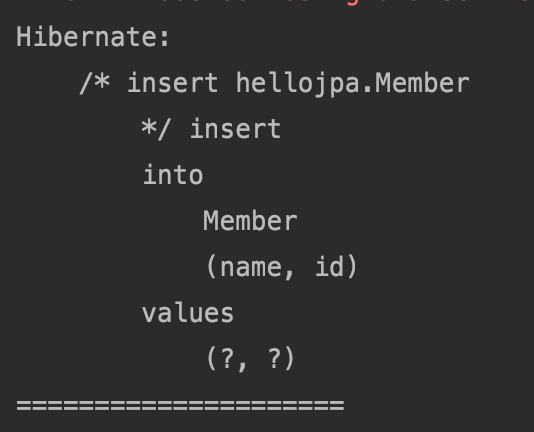

# 플러시

#### 영속성 컨텍스트의 변경내용을 데이터베이스에 반영


#### 플러시 발생

- 변경 감지
- 수정된 엔티티 쓰기 지연 SQL 저장소에 등록
- 쓰기 지연 SQL 저장소의 쿼리를 데이터베이스에 전송(등록, 수정, 삭제 쿼리)


#### 영속성 컨텍스트를 플러시하는 방법

- **em.flush()** - 직접 호출, 직접 사용은 많이 안하고 Test용으로 거의 사용
- **트랜잭션 커밋 -** 플러시 자동 호출
- **JPQL 쿼리 실행 -** 플러시 자동 호출


```java
  Member member = new Member(200L, "member200");
            em.persist(member);

            em.flush();
            
            System.out.println("=====================");
            tx.commit();//트랜잭션 커밋.
```



선이 SQL 후에 호출이 된 것을 알 수 있다. 원래는 em.flush()가 없다면 선이 호출되고 커밋할 시점에 쿼리가 날라가지만 fulsh를 강제호출 하였기에 flush()시점에 쿼리가 날라간 것을 알 수 있다.


#### JPQL 쿼리 실행시 플러시가 자동으로 호출되는 이유

member1,2,3을 persist하고 JPQL을 실행하여 조회를 한다면 member1,2,3이 커밋을 해야 조회가 된다. 그러나 flush를 자동으로 호출하므로 member1,2,3이 조회가 된다.


#### 플러시 모드 옵션

- em.setFlushMode(FlushModeType.COMMIT)
- **FlushModeType.AUTO** : 커밋이나 쿼리를 실행할 때 플러시 (기본값)
- **FlushModeType.COMMIT** : 커밋할 때만 플러시


#### 플러시는!

- 영속성 컨텍스트를 비우지 않음
- 영속성 컨텍스트의 변경내용을 데이터베이스에 동기화
- 트랜잭션이라는 작업 단위가 중요 -> 커밋 직전에만 동기화 하면 됨

