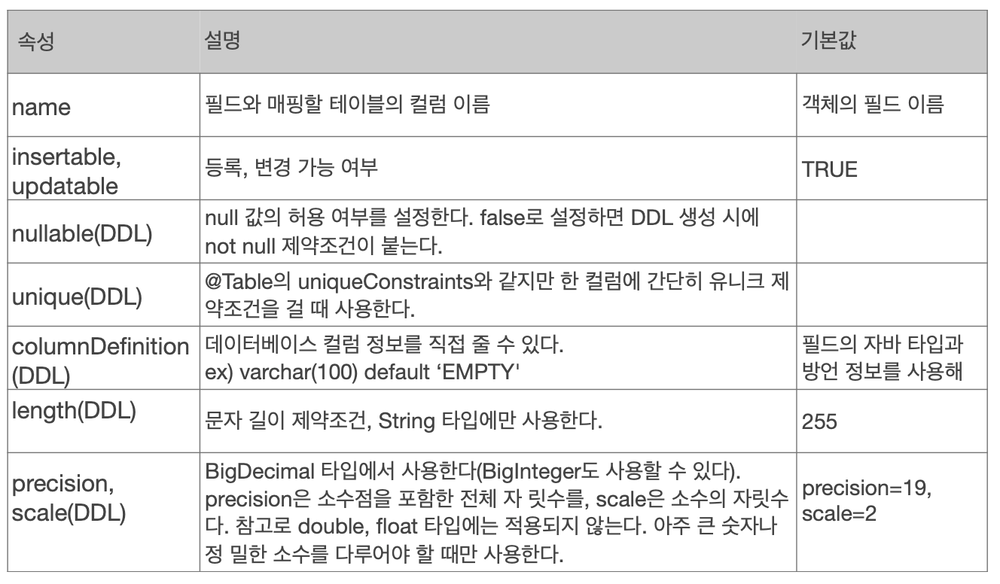
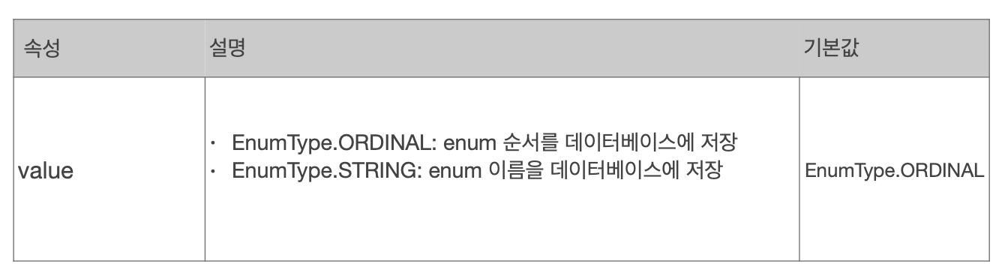
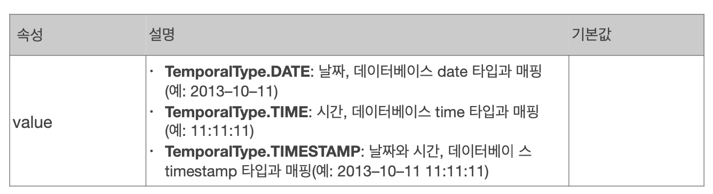

# 필드와 컬럼 매핑


#### 요구사항 추가

1. 회원은 일반 회원과관리자로 구분해야 한다.

2. 회원 가입일과 수정일이 있어야 한다.

3. 회원을 설명할 수 있는필드가 있어야 한다.이 필드는 길이제한이 없다.


```java
package hellojpa;

import javax.persistence.*;
import javax.persistence.criteria.CriteriaBuilder;
import java.util.Date;

@Entity
public class Member {

    @Id//PK 맵핑
    private long id;

    @Column(name = "name")//객체는 username , DB에는 name
    private String uesrname;

    private Integer age;

    //DB에는 EnumType이 없음, 그래서 Enumerated 애노테이션을 사용하면된다.
    @Enumerated(EnumType.STRING)
    private RoleType roleType;
    //DB에는 DATE,TIME, TIMESTAMP를 구분해서 사용.
    @Temporal(TemporalType.TIMESTAMP)//
    private Date createDate;

    @Temporal(TemporalType.TIMESTAMP)
    private Date lastModifiedDate;
    //varchar를 넘어서 큰 컨텐츠를 넣고 싶으면 Lob을 사용.
    @Lob
    private String description;

    public Member(){

    }

}

```


String, @Lob을 사용하면 clob으로 매핑.


#### 매핑 어노테이션 정리

hibernate.hbm2ddl.auto

| 어노테이션  | 설명                                                         |
| ----------- | ------------------------------------------------------------ |
| @Column     | 컬럼 매핑                                                    |
| @Temporal   | 날짜 타입 매핑                                               |
| @Enumerated | enum 타입 매핑                                               |
| @Lob        | BLOB, CLOB 매핑                                              |
| @Transient  | 특정 필드를 컬럼에 매핑하지 않음(매핑 무시), DB와 관계없이 메모리에서만 사용하고 싶을 때 |


#### @Column




#### **@Enumerated**

**자바** **enum** **타입을 매핑할 때 사용**

**주의! ORDINAL 사용X**



EnumType.ORDINAL을 사용할 경우 순서가 저장되므로 integer로 db에 매핑된다. 그러므로 enum타입을 사용할 때는 항상 STRING을 사용.


#### **@Temporal**

**날짜 타입(java.util.Date, java.util.Calendar)을 매핑할 때 사용**
**참고: LocalDate, LocalDateTime을 사용할 때는 생략 가능(최신 하이버네이트 지원)**




#### **@Lob**

- **데이터베이스** **BLOB, CLOB** **타입과 매핑**

- **@Lob에는 지정할 수 있는 속성이 없다.**

- **매핑하는 필드 타입이 문자면** CLOB매핑, 나머지는 BLOB 매핑
  - CLOB: String, char[], java.sql.CLOB
  - BLOB: byte[], java.sql. BLOB

#### **@Transient**

- 필드 매핑X
- 데이터베이스에 저장X,조회X
- 주로 메모리상에서만 임시로 어떤 값을 보관하고 싶을 때 사용

- @Transient
  private Integer temp;

