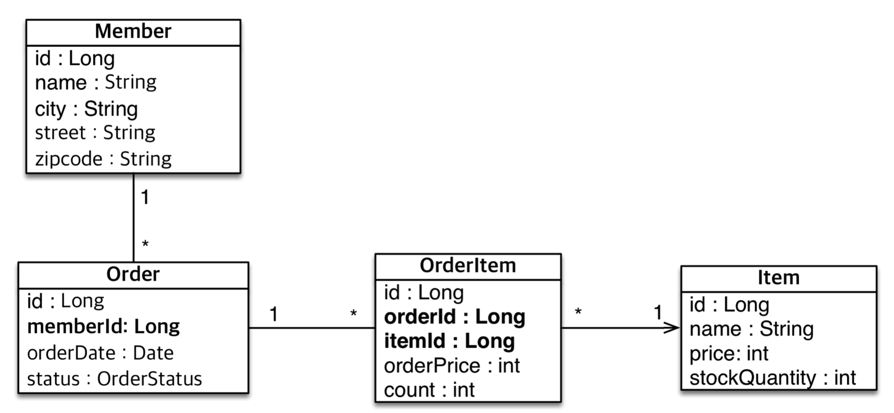

# 실전 예제 1 - 요구사항 분석과 기본 매핑


#### 요구사항 분석

- 회원은 상품을 주문할 수 있다.
- 주문시여러종류의상품을선택할수있다.


#### 기능 목록

- 회원기능
  - 회원등록
  - 회원조회
- 상품기능
  - 상품등록
  - 상품수정
  - 상품조회

- 주문기능
  - 상품주문
  - 주문내역조회
  - 주문취소


#### 도메인 모델 분석

- **회원과 주문의 관계**: **회원**은 여러 번 **주문**할 수 있다. (일대다)
- **주문과 상품의 관계** : **주문**할 때 여러 **상품**을 선택할 수 있다. 반대로 같은 **상품**도 여러 번 **주문**될 수 있다. **주문상품**이라는 모델을 만들어서 다대다 관계를 일다대, 다대일 관계로 풀어냄


#### 테이블 설계


 

#### 엔티티 설게와 매핑




//Member.class

```java
package jpabook.jpashop.domain;

import javax.persistence.*;

@Entity
public class Member {

    @Id @GeneratedValue
    @Column(name = "MEMBER_ID")
    private Long id;
    private String name;
    private String city;
    private String street;
    private String zipcode;

    public Long getId() {
        return id;
    }

    public void setId(Long id) {
        this.id = id;
    }

    public String getName() {
        return name;
    }

    public void setName(String name) {
        this.name = name;
    }

    public String getCity() {
        return city;
    }

    public void setCity(String city) {
        this.city = city;
    }

    public String getStreet() {
        return street;
    }

    public void setStreet(String street) {
        this.street = street;
    }

    public String getZipcode() {
        return zipcode;
    }

    public void setZipcode(String zipcode) {
        this.zipcode = zipcode;
    }
}

```

//Order.class

```java
package jpabook.jpashop.domain;

import javax.persistence.*;
import java.time.LocalDateTime;

@Entity
@Table(name = "ORDERS")
public class Order {

    @Id @GeneratedValue
    @Column(name = "ORDER_ID")
    private Long id;

    @Column(name = "MEMBER_ID")
    private Long memberId;

    private LocalDateTime orderDate;

    @Enumerated(EnumType.STRING)
    private OrderStatus status;

    public Long getId() {
        return id;
    }

    public void setId(Long id) {
        this.id = id;
    }

    public Long getMemberId() {
        return memberId;
    }

    public void setMemberId(Long memberId) {
        this.memberId = memberId;
    }

    public LocalDateTime getOrderDate() {
        return orderDate;
    }

    public void setOrderDate(LocalDateTime orderDate) {
        this.orderDate = orderDate;
    }

    public OrderStatus getStatus() {
        return status;
    }

    public void setStatus(OrderStatus status) {
        this.status = status;
    }
}

```

//OrderItem.class

```java
package jpabook.jpashop.domain;

import javax.persistence.Column;
import javax.persistence.Entity;
import javax.persistence.GeneratedValue;
import javax.persistence.Id;

@Entity
public class OrderItem {

    @Id @GeneratedValue
    @Column(name = "ORDER_ITEM_ID")
    private Long id;

    @Column(name = "ORDER_ID")
    private Long orderId;

    @Column(name = "ITEM_ID")
    private Long itemId;

    private int orderPrice;

    private int count;

    public Long getId() {
        return id;
    }

    public void setId(Long id) {
        this.id = id;
    }

    public Long getOrderId() {
        return orderId;
    }

    public void setOrderId(Long orderId) {
        this.orderId = orderId;
    }

    public Long getItemId() {
        return itemId;
    }

    public void setItemId(Long itemId) {
        this.itemId = itemId;
    }

    public int getOrderPrice() {
        return orderPrice;
    }

    public void setOrderPrice(int orderPrice) {
        this.orderPrice = orderPrice;
    }

    public int getCount() {
        return count;
    }

    public void setCount(int count) {
        this.count = count;
    }
}

```

//Item.class

```java
package jpabook.jpashop.domain;

import javax.persistence.Column;
import javax.persistence.Entity;
import javax.persistence.GeneratedValue;
import javax.persistence.Id;

@Entity
public class Item {

    @Id @GeneratedValue
    @Column(name = "ITEM_ID")
    private Long id;

    private String name;
    private int price;
    private int stockQuantity;

    public Long getId() {
        return id;
    }

    public void setId(Long id) {
        this.id = id;
    }

    public String getName() {
        return name;
    }

    public void setName(String name) {
        this.name = name;
    }

    public int getPrice() {
        return price;
    }

    public void setPrice(int price) {
        this.price = price;
    }

    public int getStockQuantity() {
        return stockQuantity;
    }

    public void setStockQuantity(int stockQuantity) {
        this.stockQuantity = stockQuantity;
    }
}

```


//OrderStatus.class

```java
package jpabook.jpashop.domain;

public enum OrderStatus {
    ORDER, CANCEL
}

```


#### 데이터 중심 설계의 문제점

- 현재 방식은 객체 설계를 테이블 설계에 맞춘 방식
- 테이블의 외래키를 객체에 그대로 가져옴
- 객체 그래프 탐색이 불가능
- 참조가 없으므로 UML도 잘못됨

```java
 Order order = em.find(Order.class, 1L);
            Long memberId = order.getMemberId();

            Member member = em.find(Member.class, memberId);

            System.out.println(member.getId());
            
            tx.commit();//트랜잭션 커밋.
```

Order에서 memberId를 찾은 후에 memberId를 사용해서 객체를 찾아야한다. 이런 방식은 객체를 관계형 DB에 맞추는 설계라는 문제가 있다. 

```java

    private Member member;

    public Member getMember() {
        return member;
    }

    public void setMember(Member member) {
        this.member = member;
    }

```

```java
            Order order = em.find(Order.class, 1L);
            
            Member findemember = order.getMember();

            System.out.println(member.getId());

            tx.commit();//트랜잭션 커밋.
```

Order class에서 이런 식으로 설계하는 것이 좋은 설계


