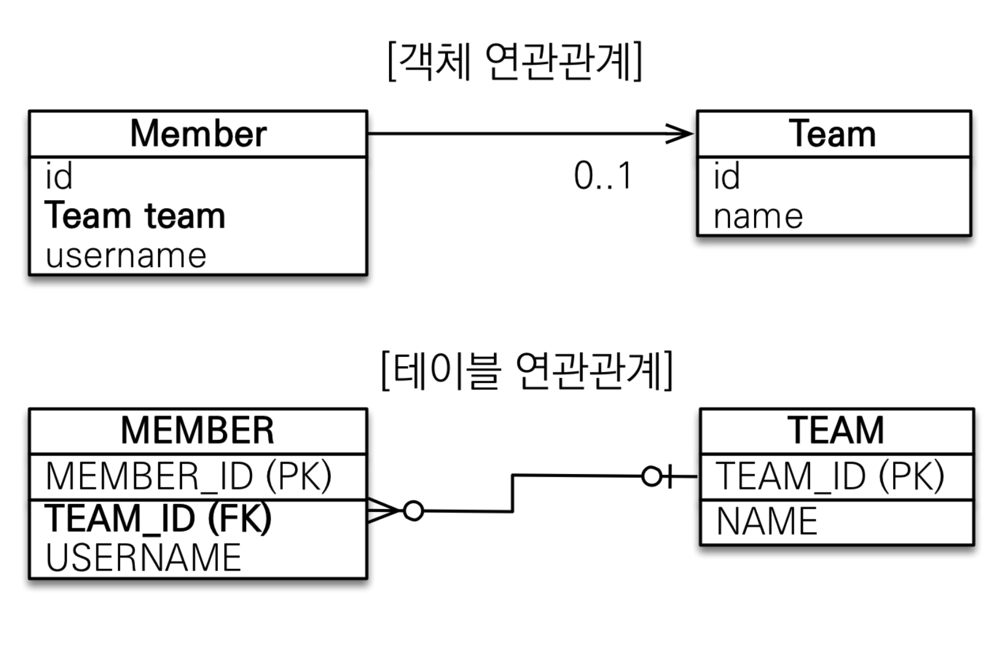

# 단방향 연관관계 - 객체 연관관계 사용



//Member.class

```java
//    @Column(name = "TEAM_ID")
//    private Long teamId;

    @ManyToOne//멤버입장에서는 many to one. 여러 멤버가 하나의 팀을 가지기 때문에.
    @JoinColumn(name = "TEAM_ID")//멤버 테이블 외래키인 TEAM_ID와 매핑을 하여야 하기에.
    private Team team;
```


위와 같이 단방향으로 연관관계를 만들면 매핑(ORM 매핑)이 끝난 것이다.


```java
            //팀 저장
            Team team = new Team();
            team.setName("TeamA");
            em.persist(team);

            //회원저장
            Member member = new Member();
            member.setName("member1");
            member.setTeam(team);
            em.persist(member);

            Member findMember = em.find(Member.class, member.getId());
            Team findTeam= findMember.getTeam();
            System.out.println("findTeam.getName() = " + findTeam.getName());

            tx.commit();//트랜잭션 커밋.
```

조회는 위와 같이 객체지향스럽게 가능하다.