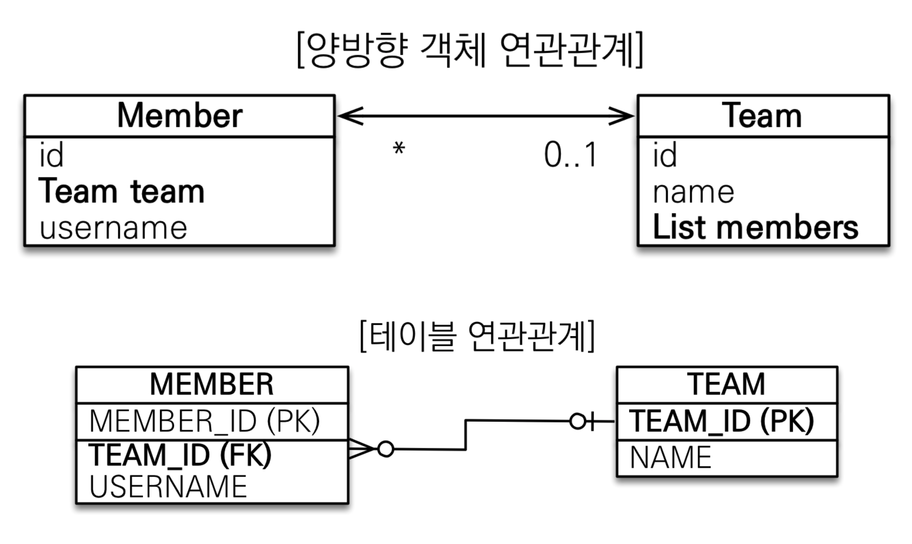
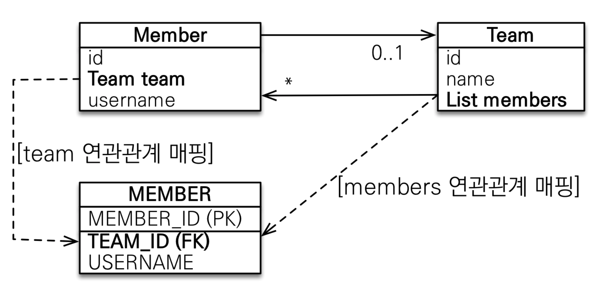
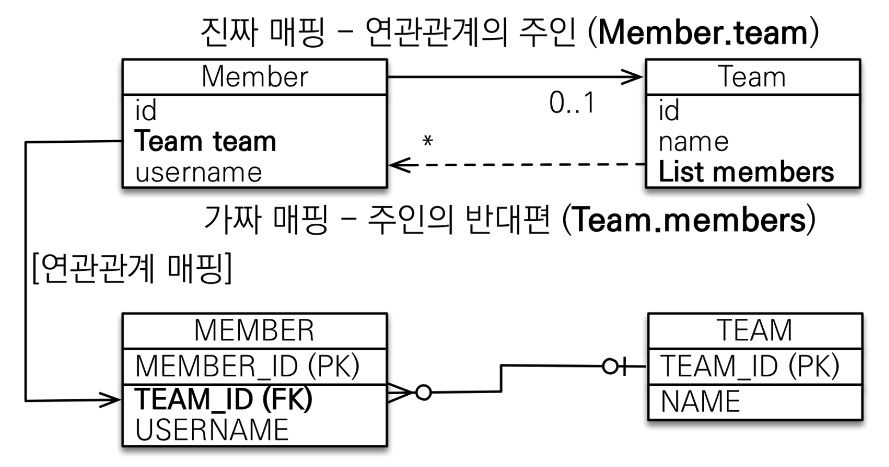

# 양방향 연관관계와 연관관계의 주인

#### 양방향 매핑



전 포스팅에서는 단방향으로 멤버에서 팀으로 가는 단방향을 설계하였다.

이번은 양방향 매핑으로 team에서 member를 갈 수 있게도 하는 것이 양방향.

**테이블 연관관계는 단방향과 양방향 테이블에는 전혀 변화가 없다.** 왜냐하면 TEAM_ID인 외래키를 사용하여 조인하여 알 수가 있다. 반대로 팀에서 어떤 멤버가 있는지 알고 싶다면 PK인 TEAM_ID와 멤버 테이블의 외래키인 TEAM_ID를 조인하면 알 수가 있다.

**여기서 중요한 것은 외래키로 인해서 테이블은 단방향 양방향이라는 개념이 없다.**

문제는 객체이다.

그래서 Team에 List members를 넣어 줘야 알 수가 있다.


Team Entity

```java
    @OneToMany(mappedBy = "team")//mappedBy는 일대다매핑에서 나는 어떤것이랑 연결되어있지를 나타내는 것. 즉, Member.class에 team 변수랑 연결.
    private List<Member> members = new ArrayList<>();//관례상 ArrayList를 new해준다.

```

Member Entity는 전 포스팅에서 한 그대로 ManyToOne을 사용하여 연결을 하였다. 그대로 사용하면 된다.


```java
package hellojpa;

import javax.persistence.EntityManager;
import javax.persistence.EntityManagerFactory;
import javax.persistence.EntityTransaction;
import javax.persistence.Persistence;
import java.util.List;

public class JpaMain {

    public static void main(String[] args) {
        EntityManagerFactory emf = Persistence.createEntityManagerFactory("hello");

        EntityManager em = emf.createEntityManager();

        EntityTransaction tx = em.getTransaction();//트랜잭션 생성.
        tx.begin();//트랜잭션 시작.

        try {
            //팀 저장
            Team team = new Team();
            team.setName("TeamA");
            em.persist(team);

            //회원저장
            Member member = new Member();
            member.setUsername("member1");
            member.setTeam(team);
            em.persist(member);

            em.flush();
            em.clear();
            
            Member findMember = em.find(Member.class, member.getId());
            List<Member> members = findMember.getTeam().getMembers();

            for (Member m : members) {
                System.out.println("m.getUsername() = " + m.getUsername());
            }

            tx.commit();//트랜잭션 커밋.
        } catch (Exception e) {
            tx.rollback();//롤백
        } finally {
            em.close();
        }

        emf.close();

    }
}

```

위와 같이 team을 사용하여 소속해 있는 member들을 찾을 수가 있다.


#### 연관관계의 주인과 mappedBy

- mappedBy = JPA의 멘탈붕괴 난이도
- mappedBy는 처음에는 이해하기 어렵다.
- 객체와 테이블간에 연관관계를 맺는 차이를 이해해야 한다.


#### 객체와 테이블이 관계를 맺는 차이

- **객체 연관관계 = 2개** : 사실은 단방향 연관관계가 두개 있는 것을 양방향이라고 하는 것.
  - 회원 -> 팀 연관관계 1개(단방향)
  - 팀 -> 회원 연관관계 1개(단방향)
- **테이블 연관관계 = 1개**
  - 회원 <-> 팀의 연관관계 1개(양방향)


#### 둘 중 하나로 외래 키를 관리해야 한다.



- Member에 team이 업데이트 될 때, 외래키인 TEAM_ID를 업데이트 해야하느냐
- Team에 members가 업데이트 될 때, 외래키인 TEAM_ID를 업데이트 해야하느냐의 딜레마.
- 예로 어떤 한 멤버가 팀을 바꿔야할 때, Member에 있는 team을 바꿔야할지, Team의 members를 바꿔야 하는지의 딜레마다.
- 둘 다 맞지만 DB 입장에서는 참조를 어떻게 하든 TEAM_ID만 업데이트 되면 된다.
- **연관관계의 주인!(Owner)**


#### 연관관계의 주인

- 양방향 매핑 규칙
  - 객체의 두 관계중 하나를 연관관계의 주인으로 지정
  - **연관관계의 주인만이 외래 키를 관리(등록, 수정)**
  - **주인이 아닌 쪽은 읽기만 가능**
  - 주인은 mappedBy 속성 사용 X
  - 주인이 아니면 mappedBy 속성으로 주인 지정
- 위에 예제에서는 주인은 Member.team


#### 누구를 주인으로?

- **외래 키가 있는 곳을 주인으로 정해라(이것은 가이드)**
  - DB 입장에서는 외래 키가 있는 곳은 항상 다
  - 외래 키가 없는 곳은 1
  - **N(@ManyToOne) 쪽에 무조건 연관관계 주인이 되어야 한다.**
- 여기서는 Member.team이 연관관계의 주인
- 
- Team.members는 읽기만 가능
- 외래 키를 관리하는 것은 Member.team(등록, 수정)


```java
Team team = new Team();
team.setName("TeamA");
em.persist(team);

Member member = new Member();
member.setName("member1");
team.getMembers().add(member); 
//연관관계의 주인에 값 설정
member.setTeam(team);
em.persist(member);
```

jpa 관점에서 본다면 위의 코드가 맞다.

그러나 객체 지향적으로 생각한다면 양쪽에 값을 설정해야 한다.

왜냐하면 저런 상태에서 커밋 후에 Team을 꺼내서 members를 조회한다면 가능할 것이다.

그러나 flush, clear를 하지 않는 상태인 1차 캐시에 있는 상태에서는 Team.members를 find()한다면 조회가 안되는 현상이 발생한다.

또한 테스트 케이스에서 JPA 없이도 동작하게 순수하게 자바 코드를 작성하는 데, 그런 상태에서는 안된다.

그래서

```java
Team team = new Team();
team.setName("TeamA");
em.persist(team);

Member member = new Member();
member.setName("member1");
team.getMembers().add(member); 
//연관관계의 주인에 값 설정
member.setTeam(team);
em.persist(member);

team.getMembers().add(member);
```

**이렇게 양방향 연관관계를 사용할 때는 양쪽 다 값을 입력해줘야 한다.**

위와 같이 코딩을 한다면 까먹을 수 있어서 양쪽 다 값을 못 줄 수 있다 그러기에 아래와 같이 **주인 세터에 따로 코딩**을 한다.

```java
    public void setTeam(Team team) {
        this.team = team;
        team.getMembers().add(this);
    }
```

위와 같이 한다면 아래와 같이 세팅한다.

```java
Team team = new Team();
team.setName("TeamA");
em.persist(team);

Member member = new Member();
member.setName("member1");
team.getMembers().add(member); 
//연관관계의 주인에 값 설정
member.setTeam(team);
em.persist(member);

```


또한 주의할 점은 양방향 매핑시에 무한 루프를 조심해야 한다.

**lombok을 사용하여 toString()과 JSON 생성 라이브러리를 조심해야 한다. toString()을 사용하면 각 필드값들을 출력하기 떄문에 무한 루프가 생길 수 있고 JSON 생성 라이브러리는 스프링 컨트롤러에서 Entity를 반환 안 하도록 한다.**


#### 양방향 매핑 정리

- **단방향 매핑만으로도 이미 연관관계 매핑은 완료**
  - 설계를 할 때, 무조건 단방향 매핑으로 설계를 완료해야 한다.

- 양방향 매핑은 반대 방향으로 조회(객체 그래프 탐색) 기능이 추가된 것 뿐

- JPQL에서 역방향으로 탐색할 일이 많음

- 단방향 매핑을 잘 하고 양방향은 필요할 때 추가해도 됨
 (테이블에 영향을 주지 않음)


#### 연관관계의 주인을 정하는 기준

- 비즈니스 로직을 기준으로 연관관계의 주인을 선택하면 안됨

- **연관관계의 주인은 외래 키의 위치를 기준으로 정해야함**