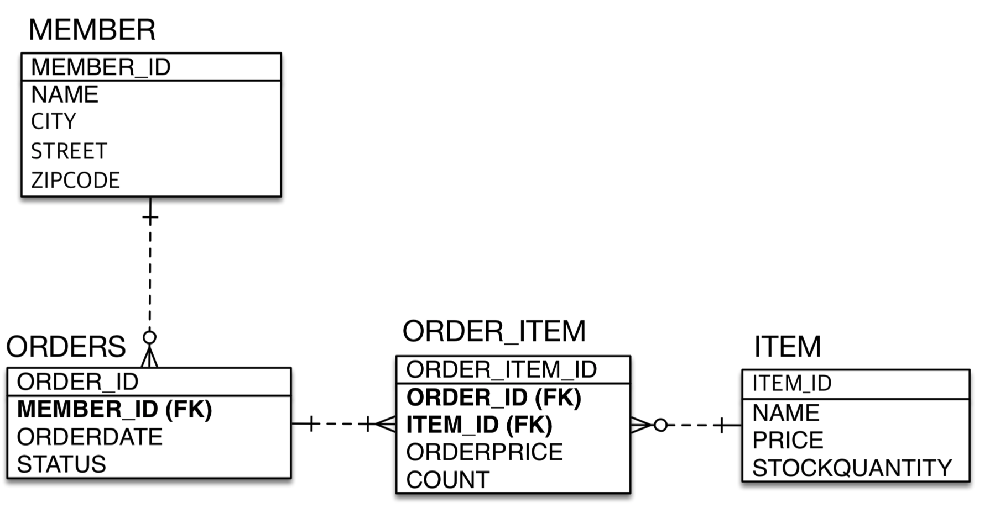
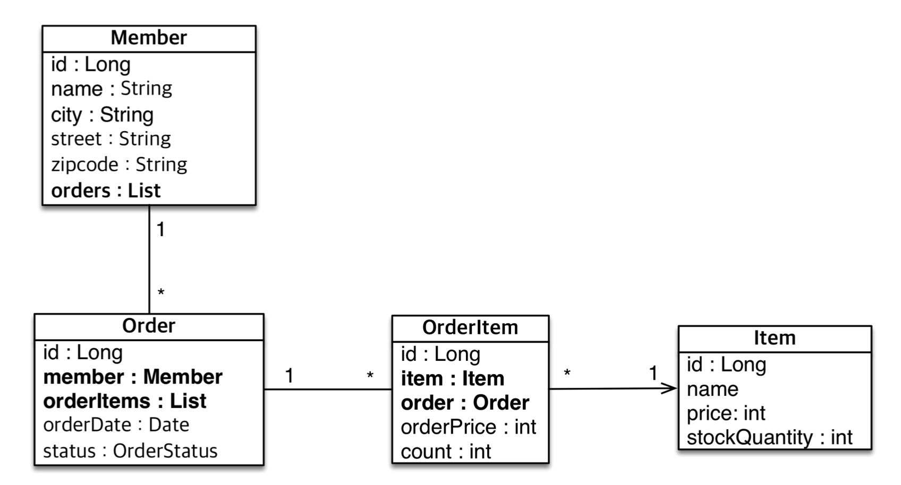

# 실전 예제2 - 연관관계 매핑

#### 테이블 구조는 같다.



#### 객체 구조 - 참조를 사용하도록 변경



 

//Order Entity

```java
package jpabook.jpashop.domain;

import javax.persistence.*;
import java.time.LocalDateTime;

@Entity
@Table(name = "ORDERS")
public class Order {

    @Id @GeneratedValue
    @Column(name = "ORDER_ID")
    private Long id;

//    @Column(name = "MEMBER_ID")
//    private Long memberId;

    @ManyToOne
    @JoinColumn(name = "MEMBER_ID")
    private Member member;

    private LocalDateTime orderDate;

    @Enumerated(EnumType.STRING)
    private OrderStatus status;

    public Long getId() {
        return id;
    }

    public void setId(Long id) {
        this.id = id;
    }

    public Member getMember() {
        return member;
    }

    public void setMember(Member member) {
        this.member = member;
    }

    public LocalDateTime getOrderDate() {
        return orderDate;
    }

    public void setOrderDate(LocalDateTime orderDate) {
        this.orderDate = orderDate;
    }

    public OrderStatus getStatus() {
        return status;
    }

    public void setStatus(OrderStatus status) {
        this.status = status;
    }
}

```

Order를 Member와 단방향 연관관계를 하기 위해서 

```java
    @ManyToOne
    @JoinColumn(name = "MEMBER_ID")
    private Member member;
```

위와 같이 하였다. 우선은 양방향을 설정안하고 단방향으로만 설정하였다. 즉, Order를 사용하여 Member를 참조 가능.

//OrderItem Entity

```java
package jpabook.jpashop.domain;

import javax.persistence.*;

@Entity
public class OrderItem {

    @Id @GeneratedValue
    @Column(name = "ORDER_ITEM_ID")
    private Long id;

//    @Column(name = "ORDER_ID")
//    private Long orderId;
    @ManyToOne
    @JoinColumn(name = "ORDER_ID")
    private Order order;

//    @Column(name = "ITEM_ID")
//    private Long itemId;
    @ManyToOne
    @JoinColumn(name = "ITEM_ID")
    private Item item;

    private int orderPrice;

    private int count;

    public Long getId() {
        return id;
    }

    public void setId(Long id) {
        this.id = id;
    }

    public Order getOrder() {
        return order;
    }

    public void setOrder(Order order) {
        this.order = order;
    }

    public Item getItem() {
        return item;
    }

    public void setItem(Item item) {
        this.item = item;
    }

    public int getOrderPrice() {
        return orderPrice;
    }

    public void setOrderPrice(int orderPrice) {
        this.orderPrice = orderPrice;
    }

    public int getCount() {
        return count;
    }

    public void setCount(int count) {
        this.count = count;
    }
}

```

우선은 OrderItem으로 Item과 Order를 참조 가능.


단방향으로 끝내고 양방향으로 Member로 Order들을 조회하고 싶다면

```java
package jpabook.jpashop.domain;

import javax.persistence.*;
import java.util.ArrayList;
import java.util.List;

@Entity
public class Member {

    @Id @GeneratedValue
    @Column(name = "MEMBER_ID")
    private Long id;
    private String name;
    private String city;
    private String street;
    private String zipcode;

    @OneToMany(mappedBy = "member")
    private List<Order> orders = new ArrayList<>();

    public Long getId() {
        return id;
    }

    public void setId(Long id) {
        this.id = id;
    }

    public String getName() {
        return name;
    }

    public void setName(String name) {
        this.name = name;
    }

    public String getCity() {
        return city;
    }

    public void setCity(String city) {
        this.city = city;
    }

    public String getStreet() {
        return street;
    }

    public void setStreet(String street) {
        this.street = street;
    }

    public String getZipcode() {
        return zipcode;
    }

    public void setZipcode(String zipcode) {
        this.zipcode = zipcode;
    }
}

```

에서 주석으로 표시한 것처럼하면 양방향이 된다.


이제 Order에서 OrderItem을 양방향으로 연결해보자

```java
    @OneToMany(mappedBy = "order")
    private List<OrderItem> orderItems = new ArrayList<>();
```

Order entity에 위와 같이 추가하면 Order를 통해서 OrderItem을 조회가 가능하다.


```java
            Order order = new Order();
            order.addOrderItem(new OrderItem());

```

위와 같이 주문에 아이템들을 넣는 다면 addOrderItem이라는 Order Entity에 아래와 같은 양방향 편의 메소드를 만든다

```java
public void addOrderItem(OrderItem orderItem) {
        orderItems.add(orderItem);
        orderItem.setOrder(this);
    }
```

이렇게 짜면 양 쪽으로  넣어준다.


**이렇게 양방향으로 안 짜고 단방향으로만 짜도 아무런 문제가 없다.**

그러나 실무에서 조회를 좀 더 편하게하고 JPQL을 편하게 작성을 하다보니 양방향으로 필요시 짜면 된다.

