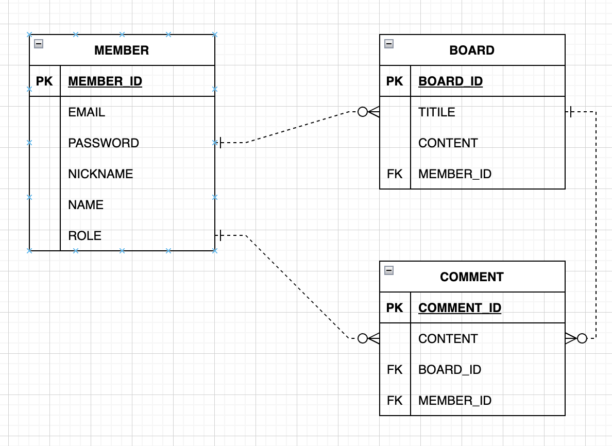

## 연관된 엔티티 조회


나의 토이 프로젝트에서는 Member와 Board, Comment 엔티티가 있다.

Member와 Board는 일대다 양방향 연관관계이며 Comment와는 일대다 단방향 연관관계이다.

Board 엔티티는 Comment 엔티티와 일대다 양방향 연관관계이며 Member와 다대일 양방향 연관관계이다.




```java
public class Comment {

    @Id
    @GeneratedValue(strategy = GenerationType.IDENTITY)
    @Column(name = "COMMENT_ID")
    private Long id;

    private String content;

    @ManyToOne(fetch = FetchType.LAZY)
    @JoinColumn(name = "BOARD_ID")//BOARD_ID FK
    private Board board;

    @ManyToOne(fetch = FetchType.LAZY)
    @JoinColumn(name = "MEMBER_ID")
    private Member member;
}
```

Member의 email로 Comment와 Board를 조회하는 것이다.


1. JPQL Fetch join

```java
@Query("select c from Comment c left join fetch c.board where c.member.email = :email")
List<Comment> findCommentsWithBoardByEmail(@Param("email") String email);
```


2. EntityGraph

```java
//공통 메서드 오버라이드
@Override
@EntityGraph(attributePaths = {"board", "member"}) List<Comment> findAll();

//JPQL + 엔티티 그래프 
@EntityGraph(attributePaths = {"board", "member"})
@Query("select c from Comment c where c.member.email = :email")
List<Comment> findCommentsWithBoardByEmailV2(@Param("email") String email);

//메서드 이름으로 쿼리에서 특히 편리하다. 
@EntityGraph(attributePaths = {"board", "member"})
List<Comment> findById(Long id);
```

- LEFT OUTER JOIN 사용

