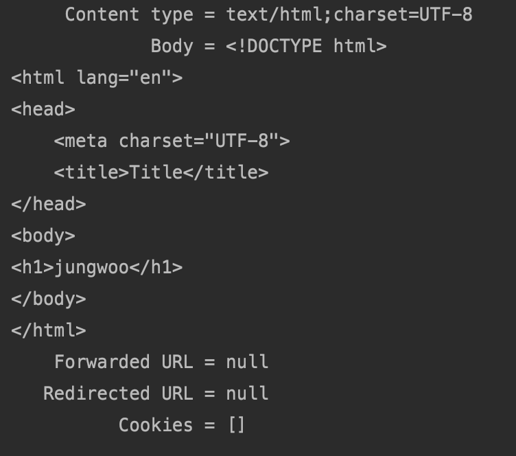

# Thymeleaf(동적 컨텐츠)

#### 스프링 부트가 자동 설정을 지원하는 템플릿 엔진

- 템블릿 엔진은 주로 뷰를 만드는 데 사용하고 코드 제너레이션, 이메일 템플릿 등을 말한다.
- 기본적인 템플릿은 같은데 들어가는 값들만 경우에 따라서 달라지는 **동적인 컨테츠**를 생성 가능.

- FreeMarker
- Groovy
- **Thymeleaf**
- Mustache


#### JSP를 권장하지 않는 이유

- 스프링부트가 지향하는 바 : 독립적으로 실행가능한 임베디드 톰캣으로 애플리케이션을 빠르고 쉽게 만들어서 배포하기를 원하는데

- JAR패키징할때는동작하지않고,WAR패키징해야함.
- Undertow는 JSP를 지원하지 않음.
- https://docs.spring.io/spring-boot/docs/current/reference/htmlsingle/#boot-features-jsp-limitations


#### Thymeleaf 사용하기

- https://www.thymeleaf.org/

- https://www.thymeleaf.org/doc/articles/standarddialect5minutes.html

- 의존성 추가: spring-boot-starter-thymeleaf

- 템플릿 파일 위치: /src/main/resources/**template/**

- 예제:

  https://github.com/thymeleaf/thymeleafexamples-stsm/blob/3.0-master/src/main/webapp/WEB-INF/templates/seedstartermng.html


```java
package com.example.demo;


import org.springframework.stereotype.Controller;
import org.springframework.ui.Model;
import org.springframework.web.bind.annotation.GetMapping;

@Controller
public class SampleController {

    @GetMapping("/hello")
    public String hello(Model model) {
        model.addAttribute("name", "jungwoo");
        return "hello";
    }
}
```

모델에 name이라는 key값으로 jungwoo를 넣고 hello라는 이름의 뷰를 찾는다.

```java
@WebMvcTest(SampleController.class)
class SampleControllerTest {

    @Autowired
    MockMvc mockMvc;

    @Test
    public void hello() throws Exception {
        // 요청 "/hello"
        // 응답
        // - 응답 모델 name : jungwoo
        // - 뷰 이름 : hello
        mockMvc.perform(get("/hello"))
                .andDo(print())
                .andExpect(status().isOk())
                .andExpect(view().name("hello"))
                .andExpect(model().attribute("name", is("jungwoo")))
                .andExpect(content().string(containsString("jungwoo")));
    }

}
```


```html
<!DOCTYPE html>
<html lang="en" xmlns:th="http://www.thymeleaf.org">
<head>
    <meta charset="UTF-8">
    <title>Title</title>
</head>
<body>
<h1 th:text="${name}">Name</h1>
</body>
</html>
```

Controller에서 정의했던 모델이 html로 넘어와서 name이라는 key값을 찾는다. 




아래를 보면 jungwoo를 가져온 것을 알 수 있다.