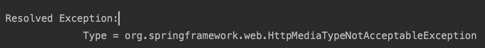
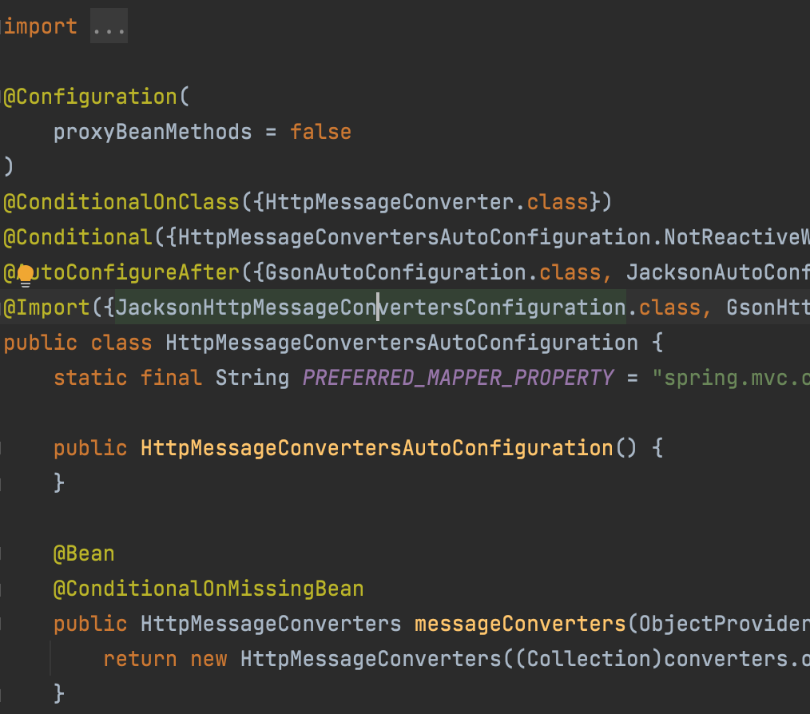
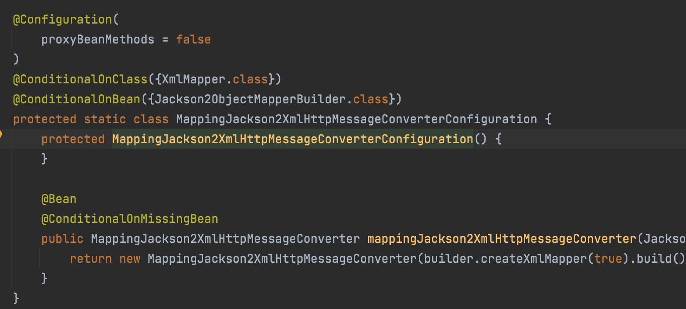
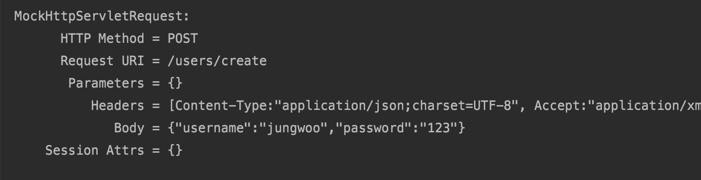
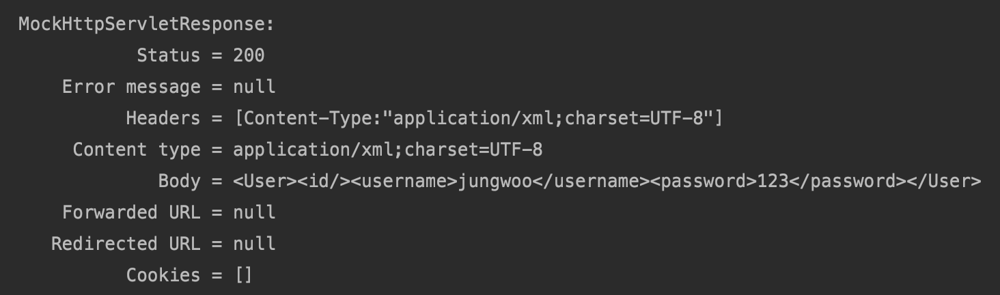

# ViewResolver


#### 스프링 부트

- 뷰리졸버설정제공
- HttpMessageConvertersAutoConfiguration


#### ContentNegotiatingViewResolver

- 이미 등록되어 있는 것.

- 뷰리졸버 중에 하나로 들어오는 요청 accept 헤더에 따라 응답이 달라진다.
  - accept 헤더라는 것은 브라우저, 클라이언트가 어떠한 타입의 응답을 원한다고 서버에게 알려주는 것
- 브라우저, 클라이언트가 어떠한 요청을 보내면 서버에서는 그에 적절한 view를 찾게 되는데, 가장 판단하는 좋은 정보는 **accept 헤더**이다.
- 그러나 accept 헤더를 제공하지 않는 요청도 존재한다. 그런 경우에 대비해서 format이라는 매개변수(파라미터)를 사용한다.
  - eq) "/path?format=pdf"


```java
    @PostMapping("/users/create")
    public User create(@RequestBody User user){
        return user;
    }
```


```java
   @Test
    public void createUser_XML() throws Exception {
        String userJson = "{\"username\":\"jungwoo\",\"password\":\"123\"}";
        mockMvc.perform(post("/users/create")
                .contentType(MediaType.APPLICATION_JSON_VALUE)
                .accept(MediaType.APPLICATION_XML)
                .content(userJson))
          			.andDo(print())
                .andExpect(status().isOk())
                .andExpect(xpath("/User/username")
                        .string("jungwoo"))
                .andExpect(xpath("/User/password")
                        .string("123"));

    }
```

accept 헤더 타입을 XML을 주고 컨텐츠 타입을 JSON 타입.

테스트 실행시 다음과 같은 오류가 등장한다.



해당하는 컨버터가 있지 않다는 소리다.



HttpMessageConvertersAutoConfiguration을 가서 JacksonHttpMessageConvertersConfiguration을 들어가면



위와 같이 @ConditionalOnClass 애노테이션이 보인다. 이것은 해당 메소드가 실행될려면 classpath에 있어햐하는 class를 보여준다. 즉, XmlMapper class가 클래스패스에 있어야 json을 xml로 컨버터를 사용할 수 있다.

```xml
        <dependency>
            <groupId>com.fasterxml.jackson.dataformat</groupId>
            <artifactId>jackson-dataformat-xml</artifactId>
            <version>2.9.6</version>
        </dependency>
```

그래서 위와 같은 의존성을 추가한다.






그 결과 정상적으로 작동하는 것을 알 수 있다.