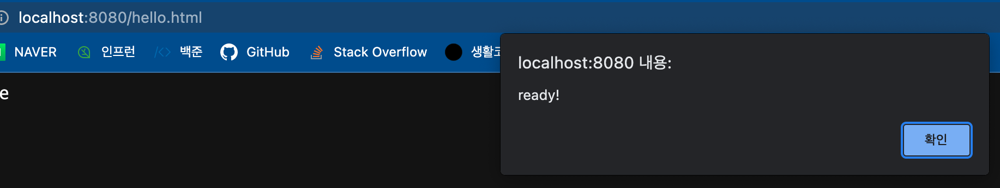

# 웹JAR

웹JAR : 클라이언트에서 사용하는 자바스크립트 라이브러리(jquery, vuejs, 부트스트랩, 앵귤러 등)을 JAR파일로 추가할 수 있는 것.

JAR파일로 의존성을 추가하고 우리가 템플릿을 사용해서 컨텐츠를 동적으로 생성하거나 정적으로 웹JAR에 있는 css,자바스크립트를 참조할 수 있다. 

mvn저장소에도 의존성이 다 있으므로 mvn 저장소에서 검색 후 의존성 추가.

```'
        <dependency>
            <groupId>org.webjars.bower</groupId>
            <artifactId>jquery</artifactId>
            <version>3.3.1</version>
        </dependency>
```


#### 웹JAR 맵핑 "/webjars/**"

- 버전 생략하고 사용하려면
  - webjars-locator-core 의존성 추가


//hello.html

```html

<!DOCTYPE html>
<html lang="en">
<head>
    <meta charset="UTF-8">
    <title>Title</title>
</head>
<body>
Hello Static Resource

<script src = "/webjars/jquery/3.3.1/dist/jquery.min.js"></script>
<script>
    $(function (){
        alert(("ready!"));
    });
</script>
</body>
</html>
```

여기서 



정상적으로 jquery를 사용하여 alert창이 나온 것을 확인 할 수 있다.