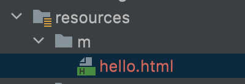

# 정적 리소스 지원

- 정적 리소스는 이미 만들어진 리소스. 즉, 요청이 서버로 들어오면 서버는 단지 리소스(뷰)를 찾아서 보내주기만하면 된다.

#### 정적 리소스 맵핑 “/**”

- 기본 리소스 위치

  - classpath:/static
  - classpath:/public
  - classpath:/resources/
  - classpath:/META-INF/resources
  - 예) “/hello.html” => /static/hello.html 
  - spring.mvc.static-path-pattern: 맵핑 설정 변경 가능
  - spring.mvc.static-locations: 리소스 찾을 위치 변경 가능

- Last-Modified 헤더를 보고 304 응답을 보냄.

  - 수정된 내용이 없으면 304응답을 보내서 더 빠르게 로딩이 가능.

- ResourceHttpRequestHandler가 처리함.

  - WebMvcConfigurer의 addRersourceHandlers로 커스터마이징 할 수 있음

  - ```java
    //WebConfig.java
    package Config;
    
    import org.springframework.context.annotation.Configuration;
    import org.springframework.web.servlet.config.annotation.ResourceHandlerRegistry;
    import org.springframework.web.servlet.config.annotation.WebMvcConfigurer;
    
    @Configuration
    public class WebConfig implements WebMvcConfigurer {
    
        @Override
        public void addResourceHandlers(ResourceHandlerRegistry registry) {
            registry.addResourceHandler("/m/**")
                    .addResourceLocations("classpath:/m/")
                    .setCachePeriod(20);
        }
    }
    
    ```

  - 리소스 핸들러를 추가하여 /m으로 시작하는 요청이 들어오면 m 디렉토리 파일들을 제공하도록 커스텀한 설정을 추가.



