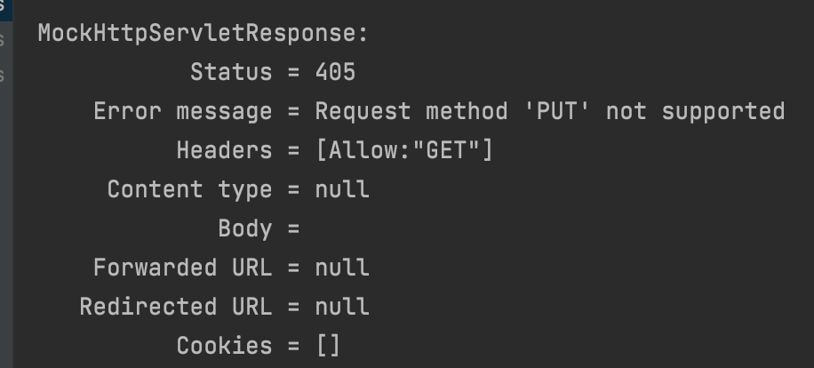

# 1. HTTP 요청 맵핑하기 (요청 메소드)


#### HTTP Method

● GET, POST, PUT, PATCH, DELETE, ...

#### GET 요청

 ● **클라이언트가 서버의 리소스를 요청할 때 사용한다.**
 ● 캐싱 할 수 있다. (조건적인 GET으로 바뀔 수 있다.)

 ● 브라우저 기록에 남는다.
 ● 북마크 할 수 있다.
 ● 민감한 데이터를 보낼 때 사용하지 말 것. (URL에 다 보이니까)

 ● idempotent : 동일한 get 요청에는 동일한 응답을 리턴해야한다라는 뜻.

#### POST 요청

 ● **클라이언트가 서버의 리소스를 수정하거나 새로 만들 때 사용한다.** 

 ● 서버에 보내는 데이터를 POST 요청 본문에 담는다.
 ● 캐시할 수 없다.
 ● 브라우저 기록에 남지 않는다.
 ● 북마크 할 수 없다.
 ● 데이터 길이 제한이 없다.

#### PUT 요청

- URI에 해당하는 데이터를 새로 만들거나 수정할 때 사용한다.
- **POST와 다른 점은 “URI”에 대한 의미가 다르다.**
  - **POST의 URI는 보내는 데이터를 처리할 리소스를 지칭하며**
  - **PUT의 URI는 보내는 데이터에 해당하는 리소스를 지칭한다.**
- Idempotent

#### PATCH 요청

- PUT과 비슷하지만, **기존 엔티티(서버)와 새 데이터의 차이점만 보낸다는 차이가 있다.**

- Idempotent

#### DELETE 요청

- URI에 해당하는 리소스를 삭제할 때 사용한다.

- Idempotent

#### 스프링 웹 MVC에서 HTTP method 맵핑하기

- @RequestMapping(method=RequestMethod.GET)
- @RequestMapping(method={RequestMethod.GET, RequestMethod.POST})
- @GetMapping, @PostMapping, ...


### URL, URI

- **URL은 자원의 위치** : http://opentutorials.org:3000/main  (URI이기도 하다, 모든 URL은 URI)
- **URI는 자원의 식별자** : http://opentutorials.org:3000/main?id=HTML&page=12


참고

● https://www.w3schools.com/tags/ref_httpmethods.asp 

● https://tools.ietf.org/html/rfc2616#section-9.3

● https://tools.ietf.org/html/rfc2068


```java
package mvc.jungwoo.demowebmvc;

import org.springframework.stereotype.Controller;
import org.springframework.web.bind.annotation.RequestMapping;
import org.springframework.web.bind.annotation.ResponseBody;

@Controller
public class SampleController {

    @RequestMapping("/hello")
    @ResponseBody
    public String hello(){
        return "hello";
    }
}

```


```java
package mvc.jungwoo.demowebmvc;

import org.junit.jupiter.api.Test;
import org.springframework.beans.factory.annotation.Autowired;
import org.springframework.boot.test.autoconfigure.web.servlet.WebMvcTest;
import org.springframework.test.web.servlet.MockMvc;

import static org.junit.jupiter.api.Assertions.*;

import static org.springframework.test.web.servlet.request.MockMvcRequestBuilders.get;
import static org.springframework.test.web.servlet.result.MockMvcResultHandlers.print;
import static org.springframework.test.web.servlet.result.MockMvcResultMatchers.content;
import static org.springframework.test.web.servlet.result.MockMvcResultMatchers.status;


@WebMvcTest
class SampleControllerTest {

    @Autowired
    MockMvc mockMvc;

    @Test //junit은 public void로 선언해야한다.
    public void helloTest() throws Exception {
        mockMvc.perform(get("/hello"))//perform : 요청 보내기, get 요청 보내기
                .andDo(print())
                .andExpect(status().isOk())
                .andExpect(content().string("hello"));//본문에 있는 문자열이 hello라고 나올 것이다.
    }
}
```


테스트에서 get말고도 post, put, delete.. 가능하다. 


body에 hello라고 나오면서 우리가 기대하던 값이 나온 것을 알 수 있다.


```java
package mvc.jungwoo.demowebmvc;

import org.springframework.stereotype.Controller;
import org.springframework.web.bind.annotation.RequestMapping;
import org.springframework.web.bind.annotation.RequestMethod;
import org.springframework.web.bind.annotation.ResponseBody;

@Controller
public class SampleController {

    @RequestMapping(value = "/hello", method = RequestMethod.GET)
    @ResponseBody
    public String hello(){
        return "hello";
    }
}
```

```java
  @RequestMapping(value = "/hello", method = RequestMethod.GET)
  
  @GetMapping("/hello")
```

이런식으로 @RequestMapping 아규먼트에 value, mathod를 설정하여 저 hello()를 get만 사용할지 , post만 사용할지 .. 등등을 설정할 수 있다.


또한 하나만 사용하는 것은 위와 같이 @GetMapping을 사용하여 간단하게 표현할 수 있다. 같은 의미이다.

@GetMapping말고도 @PostMapping 등등 있다.


```java
package mvc.jungwoo.demowebmvc;

import org.junit.jupiter.api.Test;
import org.springframework.beans.factory.annotation.Autowired;
import org.springframework.boot.test.autoconfigure.web.servlet.WebMvcTest;
import org.springframework.test.web.servlet.MockMvc;

import static org.junit.jupiter.api.Assertions.*;

import static org.springframework.test.web.servlet.request.MockMvcRequestBuilders.get;
import static org.springframework.test.web.servlet.result.MockMvcResultHandlers.print;
import static org.springframework.test.web.servlet.result.MockMvcResultMatchers.content;
import static org.springframework.test.web.servlet.result.MockMvcResultMatchers.status;


@WebMvcTest
class SampleControllerTest {

    @Autowired
    MockMvc mockMvc;

    @Test //junit은 public void로 선언해야한다.
    public void helloTest() throws Exception {
        mockMvc.perform(put("/hello"))//perform : 요청 보내기, get 요청 보내기
                .andDo(print())
                .andExpect(status().isMethodNotAllowed());
    }
}
```



맞지 않는다고 나온다.


둘 다 허용하고 싶다면

```java
 @RequestMapping(value = "/hello", method = {RequestMethod.GET, RequestMethod.PUT})
```


```java
    @Test //junit은 public void로 선언해야한다.
    public void helloTest() throws Exception {
        mockMvc.perform(get("/hello"))//perform : 요청 보내기, get 요청 보내기
                .andDo(print())
                .andExpect(status().isOk());


        mockMvc.perform(put("/hello"))//perform : 요청 보내기, get 요청 보내기
                .andDo(print())
                .andExpect(status().isOk());


        mockMvc.perform(post("/hello"))//perform : 요청 보내기, get 요청 보내기
                .andDo(print())
                .andExpect(status().isMethodNotAllowed());
    }	
```


이런 식으로 Test를 진행한다.


```java
package mvc.jungwoo.demowebmvc;

import org.springframework.stereotype.Controller;
import org.springframework.web.bind.annotation.GetMapping;
import org.springframework.web.bind.annotation.RequestMapping;
import org.springframework.web.bind.annotation.RequestMethod;
import org.springframework.web.bind.annotation.ResponseBody;

@Controller
@RequestMapping(method = RequestMethod.GET)
public class SampleController {

    @GetMapping("/hello")
    @ResponseBody
    public String hello(){
        return "hello";
    }
}
```


또한 이런식으로 @RequestMapping을 클래스 레벨에서 부여하여 클래스에 있는 모든 핸들러(메소드)에 @RequestMapping이 있는 것과 같은 결과를 보여준다.


