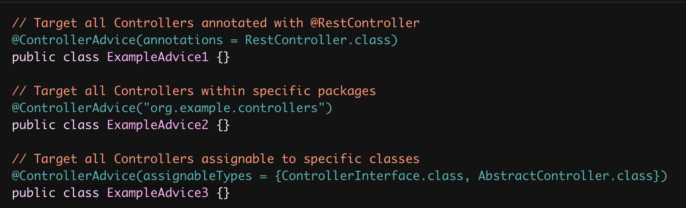

# 전역 컨트롤러 - @(Rest)ControllerAdvice


#### 예외 처리, 바인딩 설정, 모델 객체를 모든 컨트롤러 전반에 걸쳐 적용하고 싶은 경우에 사용한다.

- @ExceptionHandler
  - 컨트롤러 안에서 특정한 예외가 발생했을 때, 커스텀하여 사용
- @InitBinder
  - 컨트롤러 안에서 핸들러들이 값을 바인딩할 때, 커스텀한 로직을 추가하는 것.
- @ModelAttributes
  - 컨트롤러 안에서 모든 핸들러들이 사용할 공통적인 모델 정보

#### 적용할 범위를 지정할 수도 있다.

- 특정 애노테이션을 가지고 있는 컨트롤러에만 적용하기
- 특정 패키지 이하의 컨트롤러에만 적용하기
- 특정 클래스 타입에만 적용하기

#### 참고

● https://docs.spring.io/spring/docs/current/spring-framework-reference/web.html#mvc-ann-controller-advice


```java
package me.whiteship.demowebmvc;

import org.springframework.ui.Model;
import org.springframework.web.bind.WebDataBinder;
import org.springframework.web.bind.annotation.ControllerAdvice;
import org.springframework.web.bind.annotation.ExceptionHandler;
import org.springframework.web.bind.annotation.InitBinder;
import org.springframework.web.bind.annotation.ModelAttribute;

import java.util.List;

@ControllerAdvice
public class BaseController {

    @ExceptionHandler
    public String eventErrorHandler(EventException exception, Model model) {
        model.addAttribute("message", "event error");
        return "error";
    }


    @InitBinder
    public void initEventBinder(WebDataBinder webDataBinder)
    {
        webDataBinder.setDisallowedFields("id");
        webDataBinder.addValidators(new EventValidator());
    }


    @ModelAttribute
    public void subjects(Model model) {
        model.addAttribute("subject", List.of("study", "seminar", "hobby", "social"));
    }
}
```

이렇게 BaseController를 만들면 지역적인 아닌 전역적으로 모든 컨트롤러가 사용.

이렇게하면 모든 컨트롤러에 다 적용되기에 적용할 범위를 지정할 수 있다.

```java
@ControllerAdvice(assignableTypes = {EventController.class, EventApi.class)
```

이렇게 설정하면 난 EventController, EventApi(class)에만 사용하겠다.



