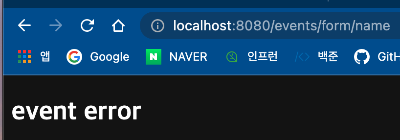

# 예외 처리 핸들러 - @ExceptionHandler

#### 특정 예외가 발생한 요청을 처리하는 핸들러 정의

- 지원하는 메소드 아규먼트 (해당 예외 객체, 핸들러 객체, ...)
- 지원하는 리턴 값
- REST API의 경우 응답 본문에 에러에 대한 정보를 담아주고, 상태 코드를 설정하려면 ResponseEntity를 주로 사용한다.

#### 참고

- https://docs.spring.io/spring/docs/current/spring-framework-reference/web.html#mvc-ann-exceptionhandler


```java
    @ExceptionHandler
    public String eventErrorHandler(EventException exception, Model model) {
        model.addAttribute("message", "event error");
        return "error";
    }
```

간단한 메시지를 띄워준다. 모델에 메시지로 event error를 넣어주고 view 이름이 error인 view를 보여준다. 그렇다면 view에서는 message라는 이름의 인자를 사용할 수 있다.


```html
<!DOCTYPE html>
<html lang="en" xmlns:th="http://www.thymeleaf.org">
<head>
    <meta charset="UTF-8">
    <title>File Upload</title>
</head>
<body>
<div th:if="${message}">
    <h2 th:text="${message}"/>
</div>


</body>
</html>
```

error.html을 만들어주고


```java
    @GetMapping("/events/form/name")
    public Event eventsFormName() {
        throw new EventException();
    }
```

에러가 발생하면 EventException 핸들러가 작동하도록 설정.



