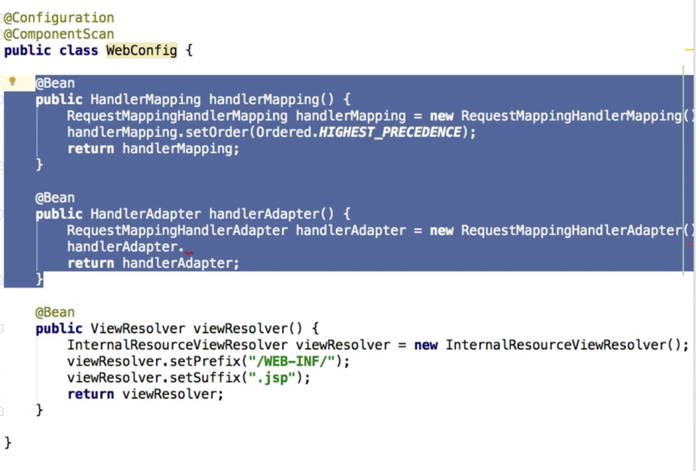

# Bean 설정 방법

### 1. (LowLevel) Bean 설정방법

다음 스크린샷처럼 @Configuration 붙어있는 클래스에서 기본전략에 커스텀하여 사용할려면 빈으로 설정하여야한다. 

그러나 이런 일일이 하나씩 다 설정하는 것은 가장 low level 방법이다. 이렇게 일일이 설정할 수 있구나로 알 수 있다.

### 2. @EnableWebMvc

그렇다면 SpringMVC에서는 필요한 빈들을 등록하기위해 어떻게 할까요? 바로 `@EnableWebMvc` 어노테이션을 사용하는 것입니다. `@EnableWebMvc`는 **어노테이션 기반의 SpringMvc를 구성할때 필요한 Bean설정들을 자동으로 해주는 어노테이션**입니다. 또한 기본적으로 등록해주는 Bean들 **이외에 추가적으로 개발자가 필요로하는 Bean들을 등록을 손쉽게 할 수 있도록 도와줍니다.**

 

#### <mvc:annotation-driven/> ?

Maven Spring MVC 프로젝트를 Eclipse에서 만들고 `web.xml`을 보셨던 분이라면 `<mvc:annotation-driven/>`이라는 태그를 많이 보셨을 것입니다. 저의 경우 인터넷을 찾아보아도 그냥 어노테이션 기반의 설정을 자동으로 해준다고 나와있어 무슨 말인가, 한참 찾아보았던적이 있습니다. 맞는 말입니다. 단지 공부가 부족했기 때문에 무슨 말인지 알아 듣질 못했던 것이죠.. 이 태그의 역할과 동일한 일을 해낼 수 있는것이 바로 `@EnableWebMvc`입니다.

 

 

#### 2.1 기본설정과 @EnableWebMvc 설정 비교

#### 2.1.1 기본설정

기본설정시 `DispatcherServlet`에 등록되는 Bean들은 이전 포스팅에서 자세히 다루었습니다. 궁금하시다면 아래의 링크를 참조해주세요.

https://galid1.tistory.com/526

https://galid1.tistory.com/527

 

 

#### 2.1.2 @EnableWebMvc

**@EnableWebMvc**는 Annotation기반의 Spring MVC를 간편하게 설정할 수 있도록 도와주는 어노테이션 입니다. 이 어노테이션을 사용하면 자동으로 Annotation기반의 MVC설정 Bean들이 추가됩니다.

debugging을 하는 방법도 이전 포스팅에서 다루어 보았으므로, 바로 debugging을 하며 설명드리겠습니다.

 

#### HandlerMapping

우선 HandlerMapping 입니다. 기본 설정시에는 `RequestMappingHandlerMaping`객체의 우선순위가 더 낮기때문에 아래에 있었지만, 어노테이션 기반을 돕는 설정이기 때문에 `RequestMappingHandlerMapping`이 위로 올라온 것을 볼 수 있습니다.

 

각 Mapping의 Order를 보면 훨씬 직관적으로 바뀐것을 볼 수 있습니다. 위 그림은 한눈에 보기위해 편집한 그림입니다.

 

추가적으로 Interceptor 도 자동으로 등록되는 것을 볼수 있습니다. (기본설정의 경우 Interceptor가 아예 없습니다.)

 

 

#### HandlerAdapter

`HandlerAdapter`의 messageConverters의 경우 7개의 converter가 자동으로 등록되어 있는 것을 볼 수 있습니다. 추가적으로 Jackson 의존성이 추가되어있다면 requestbody, responsebody에 json형식으로 컨버팅이 가능한 Converter가 자동으로 등록이 되도록 되어있습니다. 어떻게 추가 되는지 간단히 살펴보겠습니다.

 

**WebMvcConfigurationSupport Class**

**WebMvcConfigurationSupport** class에 가면 static 필드에서 classpath를 탐색해 해당 클래스들이 존재하는지를 보고 존재의 진위여부를 boolean값으로 저장합니다. 이 boolean 값은 앞으로 설명드릴 messageConverter 등록 과정에서 사용됩니다.

**WebMvcConfigurationSupport class** 의 RequestMappingHandlerAdapter를 Bean으로 등록하는 메소드 입니다. 해당 메소드에서는 RequestMappingHandlerAdapter 객체를 생성한 뒤 각각의 필요한 필드 값들을 또다른 메소드를 통해 등록하고 있습니다. **messageConverter** 를 등록하기 위해 사용되는 **getMessageConverters()** 메소드를 보겠습니다.

getMessageConverters() 메소드에서는 개발자가 따로 **registry를 통해 등록한 MessageConverter**가 존재하는지를 파악합니다. 만약 없다면 **addDefaultHttpMessageConverters()**를 다시 호출합니다.

바로 여기서 맨 처음 static 필드에서 초기화 했던 boolean 값들을 이용하게 됩니다. 여기서 각각의 Class들이 classpath에 존재하는지를 파악한 뒤 만약 존재한다면 그에 해당하는 MessageConverter들을 자동으로 등록하게 됩니다.

 

#### 2.2 @EnableWebMvc 간략 분석

 

`@EnableWebMvc` 어노테이션을 살펴보면 내부에 다시 `DelegatingWebMvcConfiguration`클래스를 Import 하고 있는 것을 볼 수 있습니다.

 

`DelegatingWebMvcConfiguration` 클래스를 살펴보면 필요한 모든 Bean들을 등록하기 위해 delegation(위임)을 사용하고 있는 것을 알 수 있습니다. 이렇게 모든 것들을 위임을 이용하여 사용한 이유는 확장을 용이하게 하기 위해서 라고 합니다.

 

 

#### 2.3 @EnableWebMvc 어노테이션 사용시 설정 추가 방법 (WebMvcConfigurer Interface)

**WebMvcConfigurer Interface**는 **@EnableWebMvc** 어노테이션에서 제공하는 Bean을 커스터마이징(설정)할 수 있는 기능을 제공하는 인터페이스 입니다.

확장을 위해 `WebMvcConfigurer`를 구현합니다. 이때 확장을 필요로하는 메소드만을 구현하여 확장해주면 됩니다. 인터페이스를 사용했지만 abstract 클래스처럼 사용할 수 있는 이유는 각각의 메소드를 default로 작성했기 때문입니다.

 

위의 경우 간단히 우리가 손수 Bean으로 등록해주었던 `InternalResourceViewResolver`대신 등록하는 방법입니다. 정말 간단하게 변했죠? 이 인터페이스의 경우 SpringBoot에서도 이 인터페이스를 확장하여 필요한 기능을 확장한다고 합니다.

 

또 formatter, interceptor등 필요한 여러기능들을 너무도 손쉽게 추가할 수 있습니다.

 

#### 2.4 WebMvcConfigurer 설정방법 분석

WebMvcConfigurer 인터페이스를 구현하므로써 어떻게 이렇게 간편하게 설정을 추가할 수 있는지를 간략하게나마 분석해보겠습니다.

***EnableWebMvc 어노테이션**

우선 @EnabelWebMvc 어노테이션을 열어봅니다. 자세히 보시면 바로 상단에 **DelegatingWebMvcConfiguration**이 다시 import 된것을 볼 수 있습니다. 따라가보죠.

***DelegatingWebMvcConfiguration Class**

**DelegatingWebMvcConfiguration** Class 에는 위 그림과 같이 registry를 매개변수로 하는 메소드들이 많습니다. 이 메소드들은 DeletatingWebMVCConfiguration의 상위 클래스인 WebMVCConfigurationSupport 로부터 오버라이딩 한것입니다.

어떤 역할인지는 이름을 보면 알 수 있습니다. 중요한 점은 이들 모두가 registry를 매개변수로 넘겨주면서 또다른 메소드에 설정을 위임하고 있는 것을 볼 수 있습니다. 그렇게 하므로써 확장(설정 추가)의 용이함을 도모한것입니다. registry가 무슨 역할을 하는지 간단히 알아보아야 할 것같습니다.

***Registry(ViewResolverRegistry)**

위 그림은 여러 Registry들중 ViewResolver에대한 설정을 포함하는 **ViewResolverResgistry**입니다. 필드로 ViewResolver들을 담을 수 있는 **List**와, **order**가 눈에 띕니다. 메소드를 살펴보시면 앞서서 저희가 사용했던 **jsp()** 메소드가 보입니다. **여기서 InternalResourceViewResolver를 생성하고 prefix, suffix를 설정하고 위에서 본 List에 추가하는 것을 볼 수 있습니다.**

**
**

**
**

***WebMvcConfigurationSupport**

configureViewResolvers() 메소드와, registry가 무엇인지를 알아보았으니, 이제는 configureViewResolvers()가 상위클래스에서 어떻게, 언제, 왜 호출되는지를 알아보겠습니다. 위 그림은 **DelegatingWebMvcConfiguration** Class 가 상속받고 있는 **WebMvcConfigurationSupport** class 입니다.

그중 ViewResolver를 bean으로 등록하는 mvcViewResolver() 메소드를 보겠습니다. 맨 처음 **ViewResolverRegistry** 객체를 생성한 뒤, 앞서서 알아본 **configureViewResolvers(registry)** 메소드에 매개변수로 넘겨주며 호출하는 것을 볼 수 있습니다. 바로 이곳에서 우리가 설정한 viewResolver가 **Registry**에 등록되는 것입니다. 

그 후 registry에 설정이 끝나면 composite라는 ViewResolver에 registry에 설정된 **ViewResolver List**들을 등록하는 것입니다. 마지막으로 registry에 등록되어있던 모든 ViewResolver들을 가진 **compositeViewResolver**를return하므로써 **DispatcherServlet**에 등록됩니다.

### 3. SpringBoot에서의 설정

사실 **formatter, converter, genericConverter**의 경우 **SpringBoot**에서는 이들을 Bean으로만 등록하면 자동으로 설정을 해줍니다. 위와 같이 이미 BeanFactory에서 해당 타입의 bean들을 찾아와 registry에 등록해주기 때문입니다.