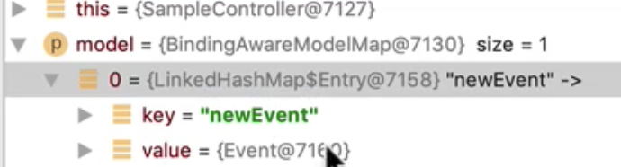

# Flash Attributes

#### 주로 리다이렉트시에 데이터를 전달할 때 사용한다.

- 데이터가 URI에 노출되지 않는다.
- 임의의 객체를 저장할 수 있다.
- 보통 HTTP 세션을 사용한다.

#### 리다이렉트 하기 전에 데이터를 HTTP 세션에 저장하고 리다이렉트 요청을 처리 한 다음 

#### 그 즉시 제거한다. RedirectAttributes를 통해 사용할 수 있다.


#### XPath

- https://www.w3schools.com/xml/xpath_syntax.asp
- https://www.freeformatter.com/xpath-tester.html#ad-output


```java
    @PostMapping("/events/form/limit")
    public String eventFormLimitSubmit(@Validated @ModelAttribute Event event,
                                      BindingResult bindingResult,
                                       SessionStatus sessionStatus,
                                       RedirectAttributes attributes) {
        if (bindingResult.hasErrors()) {
            return "/events/form-limit";
        }
        sessionStatus.setComplete();
        attributes.addFlashAttribute("newEvent", event);
        return "redirect:/events/list";
    }
```

addFlashAttribute를 할 수 있는데 이 newEvent 객체가 바로 HTTP 세션에 들어간다. 그리고 리다이렉트 된 곳에서 사용하고 제거가 된다. 세션에 들어가기 때문에 URI에 노출되지 않는다.


@ModelAttribute("newEvent") Event event로도 받을 수 있지만 세션에 있기에 Model을 선언만해도 바로 사용이 가능하다.

```java
   @GetMapping("/events/list")
    public String getEvents(Model model,
                            @SessionAttribute LocalDateTime visitTime) {
        System.out.println(visitTime);


        Event spring = new Event();
        spring.setName("spring");
        spring.setLimit(10);

        Event newEvent = (Event) model.asMap().get("newEvent");

        List<Event> eventList = new ArrayList<>();
        eventList.add(spring);
        eventList.add(newEvent);


        model.addAttribute(eventList);

        return "/events/list";
    }
```

모델로 받아와서 asMap()을 사용하여 newEvent.

asMap()은 Map으로 변환하는 메서드이다. 맵으로 변환하여 key값 newEvent를 사용하여 get하여 newEvent에 넣는다.

세션에 newEvent가 들어가 있는 것을 알 수 있다.