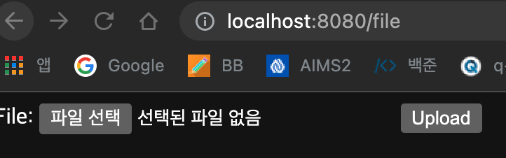
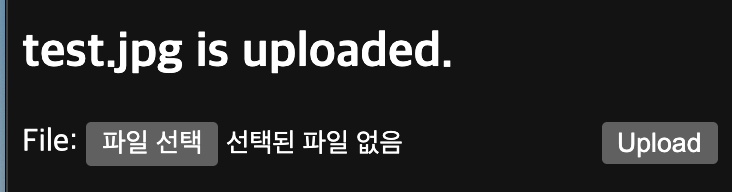

# MultipartFile

#### MultipartFile

- 파일 업로드시 사용하는 메소드 아규먼트
- MultipartResolver 빈이 설정 되어 있어야 사용할 수 있다. (스프링 부트 자동 설정이 해 줌)
- POST multipart/form-data 요청에 들어있는 파일을 참조할 수 있다.
- List<MultipartFile> 아큐먼트로 여러 파일을 참조할 수도 있다.

#### 파일 업로드 폼

```html
<form method="POST" enctype="multipart/form-data" action="#" th:action="@{/file}"> 
  File: <input type="file" name="file"/>
  <input type="submit" value="Upload"/>
</form>
```


#### 파일 업로드 처리 핸들러

```java
@PostMapping("/file")
public String uploadFile(@RequestParam MultipartFile file,
                         RedirectAttributes attributes) {
  String message = file.getOriginalFilename() + " is uploaded.";
  System.out.println(message);
  attributes.addFlashAttribute("message", message);
  return "redirect:/events/list";
}
```

@RequestParam MultipartFile file에서 file이란 이름은 파일 업로드 폼에서  <input type="file" name="file"/>에서 name을 file이라고 했으므로 그대로 사용하였다. 만약에 핸들러에서 다른 이름을 사용하고 싶다면 @RequestParam("file") MultipartFile newFile 이렇게 받을 수 있다.

원래는 저장을하고 처리를 해야하는데 여기서는 저장되었다고 가정하고 한다. RedirectAttributes을 사용하여 FlashAttribute로 메시지를 보낸다. 

#### 메시지 출력

```html
<div th:if="${message}">
	<h2 th:text="${message}"/>
</div>
```

#### 파일 업로드 관련 스프링 부트 설정

- MultipartAutoConfiguration
- MultipartProperties

#### 참고

- https://docs.spring.io/spring/docs/current/spring-framework-reference/web.html#mvc-multipart-forms
- https://spring.io/guides/gs/uploading-files/


```java
@Controller
public class FileController {

    @GetMapping("/file")
    public String fileUploadForm(Model model) {
        return "/files/index";
    }

    @PostMapping("/file")
    public String fileUpload(@RequestParam MultipartFile file,
                             RedirectAttributes attributes) {
        String message = file.getOriginalFilename() + " is uploaded.";
        System.out.println(message);
        attributes.addFlashAttribute("message", message);
        return "redirect:/file";
    }
}
```

http://localhost:8080/file로 접속을 하면 Getmapping에 의해서 fileUploadForm이 실행되고 아래에 index view가 실행된다.

```html
<!DOCTYPE html>
<html lang="en" xmlns:th="http://www.thymeleaf.org">
<head>
    <meta charset="UTF-8">
    <title>File Upload</title>
</head>
<body>
<div th:if="${message}">
    <h2 th:text="${message}"/>
</div>
<form method="POST" enctype="multipart/form-data" action="#"
      th:action="@{/file}"> File: <input type="file" name="file"/>
    <input type="submit" value="Upload"/>
</form>

</body>
</html>
```

메시지 출력 부분에서 if문을 사용하여 메시지가 있으면 메시지를 출력한다. 처음 실행시에는 메시지가 없을 것이다. 그래서 아리 form이 실행되어지고 post, /file에 맵핑된다.


그러면 컨트롤러에서 fileUpload가 실행되고 원래는 저기서 파일이 저장장소에 저장이 된다. 그러나 여기서는 매커니즘만 이해하기 위해서 메시지에 값을 넣고 세션에 저장한다. 그 다음 리다이렉트하여 /file로 다시 맵핑한다.

그러면 다시 fileUploadForm가 실행되고 세션에 저장되어있기 때문에 model에 자동으로 들어가진다.  다시 뷰를 보여주는데 이제는 메시지가 존재하기 때문에 메시지를 출력한다.




