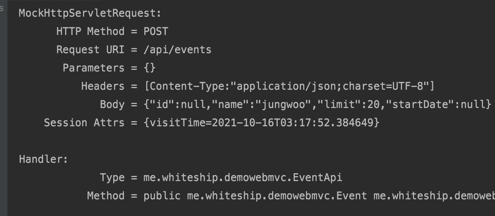
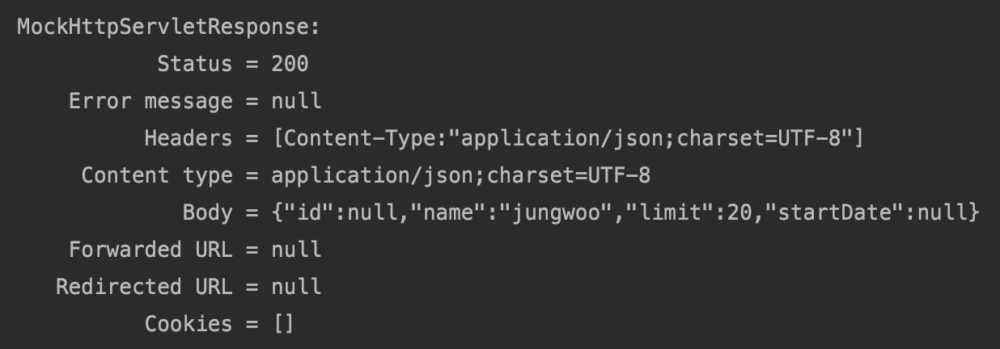
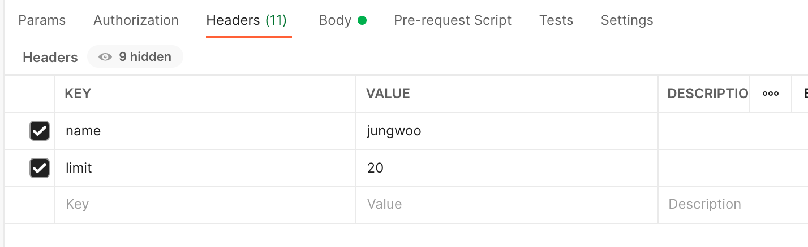
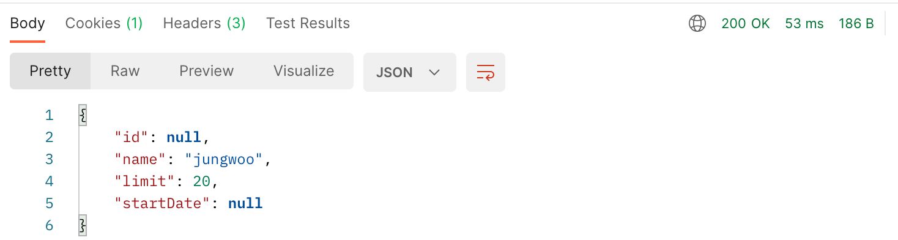

# **@RequestBody & HttpEntity**

##### 이 두가지 다 요청 본문(body)에 들어있는 데이터를 Http Message Converter를 사용하여 변환해서 변환한 타입으로 받을 수 있는 아규먼트.

#### @RequestBody

- 요청 본문(body)에 들어있는 데이터를 HttpMessageConveter를 통해 변환한 객체로 받아올 수 있다.
- @Valid 또는 @Validated를 사용해서 값을 검증 할 수 있다.
- BindingResult 아규먼트를 사용해 코드로 바인딩 또는 검증 에러를 확인할 수 있다.

#### HttpMessageConverter

- 스프링 MVC 설정 (WebMvcConfigurer)에서 설정할 수 있다.
- configureMessageConverters: 기본 메시지 컨버터 대체
- extendMessageConverters: 메시지 컨버터에 추가
- 기본 컨버터
  - WebMvcConfigurationSupport.addDefaultHttpMessageConverters

#### HttpEntity

- @RequestBody와 비슷하지만 추가적으로 요청 헤더 정보를 사용할 수 있다.


#### 참고

- https://docs.spring.io/spring/docs/current/spring-framework-reference/web.html#mvc-ann-requestbody
- https://docs.spring.io/spring/docs/current/spring-framework-reference/web.html#mvc-ann-httpentity


```java
//EventApi
package me.whiteship.demowebmvc;

import org.springframework.web.bind.annotation.PostMapping;
import org.springframework.web.bind.annotation.RequestBody;
import org.springframework.web.bind.annotation.RequestMapping;
import org.springframework.web.bind.annotation.RestController;

@RestController
@RequestMapping("/api/events")
public class EventApi {

    @PostMapping
    public Event createEvent(@RequestBody Event event) {
        //save event
        return event;
    }
}
```

요청 본문에 들어있는 데이터를 Event 객체로 convert할라고 한다. 이럴 때 사용하는 것이 HttpMessageConveter이고 HttpMessageConveter에 기본적으로 등록되어있는  메시지컨버터들을 **핸들러 어댑터**가 사용하게 된다. HttpMessageConveter를 핸들러 어댑터가 사용해서 메시지 아규먼트(@RequestBody Event event)를 리졸빙할 때, 적절한 메시지컨버터를 선택해서 사용한다.

요청 헤더에 보통 컨텐츠 타입이 들어있다. 그 컨텐츠 타입을 보고 적절한 메시지 컨버터를 선택해서 Event객체로 Convert.


```java
//EventApiTest
package me.whiteship.demowebmvc;

import com.fasterxml.jackson.databind.ObjectMapper;
import org.junit.Test;
import org.junit.runner.RunWith;
import org.springframework.beans.factory.annotation.Autowired;
import org.springframework.boot.test.autoconfigure.web.servlet.AutoConfigureMockMvc;
import org.springframework.boot.test.context.SpringBootTest;
import org.springframework.http.MediaType;
import org.springframework.test.context.junit4.SpringRunner;
import org.springframework.test.web.servlet.MockMvc;

import static org.springframework.test.web.servlet.request.MockMvcRequestBuilders.post;
import static org.springframework.test.web.servlet.result.MockMvcResultHandlers.print;
import static org.springframework.test.web.servlet.result.MockMvcResultMatchers.jsonPath;
import static org.springframework.test.web.servlet.result.MockMvcResultMatchers.status;

@RunWith(SpringRunner.class)
@SpringBootTest
@AutoConfigureMockMvc
public class EventApiTest {

    @Autowired
    ObjectMapper objectMapper;

    @Autowired
    MockMvc mockMvc;

    @Test
    public void createEvent() throws Exception {
        Event event = new Event();
        event.setName("jungwoo");
        event.setLimit(20);

        String json = objectMapper.writeValueAsString(event);//객체를 json 문자열로 변환

        mockMvc.perform(post("/api/events")
                .contentType(MediaType.APPLICATION_JSON_UTF8)
                .content(json))//body
                .andDo(print())
                .andExpect(status().isOk())
                .andExpect(jsonPath("name").value("jungwoo"))
                .andExpect(jsonPath("limit").value(20))
        ;
    }

}
```

ObjectMapper를 사용하면 객체를 json 문자열로, json 문자열을 객체로 바꿀 수 있다.






정상적으로 test가 완료된 것을 알 수 있다.


서버로 보고 싶다면 postman으로 확인할 수 있다.



헤더에 값을 넣고


바디를 json으로 바꾼 뒤 test에서 요청으로 보냈던 바디를 복사하여 json에 입력하고

Post를 보내면




200응답으로 정상적으로 되는 것을 알 수 있다.


```java
 package me.whiteship.demowebmvc;

import org.springframework.http.HttpEntity;
import org.springframework.http.MediaType;
import org.springframework.web.bind.annotation.PostMapping;
import org.springframework.web.bind.annotation.RequestBody;
import org.springframework.web.bind.annotation.RequestMapping;
import org.springframework.web.bind.annotation.RestController;

@RestController
@RequestMapping("/api/events")
public class EventApi {

    @PostMapping
    public Event createEvent(HttpEntity<Event> request) {
        //save event
        MediaType contentType = request.getHeaders().getContentType();
        System.out.println(contentType);
        return request.getBody();
    }
}
```

HttpEntity로도 할 수 있다.

```java
HttpEntity<Event> request
```

이 부분에서 설정한 <>부분인 제네릭타입(바디타입)에 해당하는 본문이 나온다.

다른 점은 헤더 정보에도 접근할 수 있다.


바인딩 에러가 나왔을 때, BindingResult를 설정안하면 400으로 응답하여 에러가 뜬다. 400에러가 뜨면 요청을 처리하지 못한다. 그러나 우리가 커스텀하여 바인딩 에러가 나왔을 때 설정하고 싶다면 ModelAttribute와 동일하게 설정할 수 있다.

BindingResult를 했을 때는 400에러가 나와도 요청을 처리한다.

```java
package me.whiteship.demowebmvc;

import org.springframework.http.HttpEntity;
import org.springframework.http.MediaType;
import org.springframework.validation.BindingResult;
import org.springframework.web.bind.annotation.PostMapping;
import org.springframework.web.bind.annotation.RequestBody;
import org.springframework.web.bind.annotation.RequestMapping;
import org.springframework.web.bind.annotation.RestController;

import javax.validation.Valid;

@RestController
@RequestMapping("/api/events")
public class EventApi {

    @PostMapping
    public Event createEvent(@RequestBody @Valid Event event, BindingResult bindingResult) {
        //save event
        if(bindingResult.hasErrors()){
            bindingResult.getAllErrors().forEach(error->{
                System.out.println(error);
            });
        }
        return event;
    }
}
```

지금은 저렇게 그냥 에러가 있을 때, 단순하게 출력만 하였지만 저기에 에러가 발생했을 때 400에러를 보내긴 할껀데 원하는 처리를 추가적으로 할 수 있다.


또한 우리가 원하는 기본적으로 Http Converter가 설정이 안되어있으면 WebConfig에서 extendMessageConverters을 설정하면 된다.

```java
package me.whiteship.demowebmvc;

import org.springframework.context.annotation.Configuration;
import org.springframework.http.converter.HttpMessageConverter;
import org.springframework.web.servlet.config.annotation.EnableWebMvc;
import org.springframework.web.servlet.config.annotation.InterceptorRegistry;
import org.springframework.web.servlet.config.annotation.PathMatchConfigurer;
import org.springframework.web.servlet.config.annotation.WebMvcConfigurer;
import org.springframework.web.util.UrlPathHelper;

import java.util.List;

@Configuration
@EnableWebMvc
public class WebConfig implements WebMvcConfigurer {

    @Override
    public void configurePathMatch(PathMatchConfigurer configurer) {
        UrlPathHelper urlPathHelper = new UrlPathHelper();
        urlPathHelper.setRemoveSemicolonContent(false);
        configurer.setUrlPathHelper(urlPathHelper);
    }

    @Override
    public void addInterceptors(InterceptorRegistry registry) {
        registry.addInterceptor(new VisitTimeInterceptor());
    }

    @Override
    public void extendMessageConverters(List<HttpMessageConverter<?>> converters) {
        WebMvcConfigurer.super.extendMessageConverters(converters);
    }
}
```

