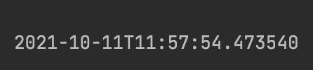

# @SessionAttribute

#### HTTP 세션에 들어있는 값 참조할 때 사용

- HttpSession을 사용할 때 비해 타입 컨버전을 자동으로 지원하기 때문에 조금 편리함.
- HTTP 세션에 데이터를 넣고 빼고 싶은 경우에는 HttpSession을 사용할 것.

#### @SessionAttributes와는 다르다.

- @SessionAttributes는 해당 컨트롤러 내에서만 동작.
  - 즉, 해당 컨트롤러 안에서 다루는 특정 모델 객체를 세션에 넣고 공유할 때 사용.
- @SessionAttribute는 컨트롤러 밖(인터셉터 또는 필터 등)에서 만들어 준 세션 데이터에 접근할 때 사용한다.


```java

public class VisitTimeInterceptor implements HandlerInterceptor {
    @Override
    public boolean preHandle(HttpServletRequest request, HttpServletResponse response, Object handler) throws Exception {
        HttpSession session = request.getSession();
        if(session.getAttribute("visitTime") == null){
            session.setAttribute("visitTime", LocalDateTime.now());
        }
        return true;
    }
}
```

사용자가 접속한 시간을 측정하는 인터셉터를 만든다.

세션에 visitTime이 없다면 측정될 것이다.

```java
package me.whiteship.demowebmvc;

import org.springframework.context.annotation.Configuration;
import org.springframework.web.servlet.config.annotation.EnableWebMvc;
import org.springframework.web.servlet.config.annotation.InterceptorRegistry;
import org.springframework.web.servlet.config.annotation.PathMatchConfigurer;
import org.springframework.web.servlet.config.annotation.WebMvcConfigurer;
import org.springframework.web.util.UrlPathHelper;

@Configuration
@EnableWebMvc
public class WebConfig implements WebMvcConfigurer {

    @Override
    public void configurePathMatch(PathMatchConfigurer configurer) {
        UrlPathHelper urlPathHelper = new UrlPathHelper();
        urlPathHelper.setRemoveSemicolonContent(false);
        configurer.setUrlPathHelper(urlPathHelper);
    }

    @Override
    public void addInterceptors(InterceptorRegistry registry) {
        registry.addInterceptor(new VisitTimeInterceptor());
    }
}
```

WebConfig에서 인터셉터를 등록해준다. addInterceptors 메소드로 인해서 모든 요청을 받을 때, 이 인터셉터가 실행될 것이다.

```java
@GetMapping("/events/list")
public String getEvents(Model model, @SessionAttribute LocalDateTime visitTime) {
    System.out.println(visitTime);
    Event event = new Event();
    event.setName("spring");
    event.setLimit(10);

    List<Event> eventList = new ArrayList<>();
    eventList.add(event);

    model.addAttribute(eventList);

    return "/events/list";
}
```

 



실행하고 http://localhost:8080/events/list 접속하자 시간이 나온 것을 알 수 있다.