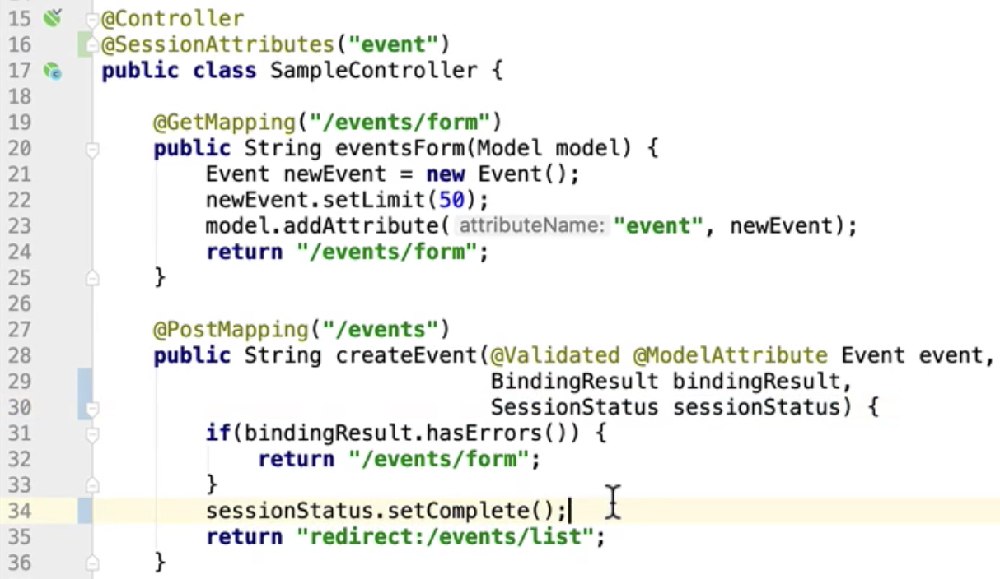

# **@SessionAttributes**

#### 모델 정보를 HTTP 세션에 저장해주는 애노테이션

- HttpSession을 직접 사용할 수도 있지만
- 이 애노테이션에 설정한 이름에 해당하는 모델 정보를 자동으로 세션에 넣어준다.
- @ModelAttribute는 세션에 있는 데이터도 바인딩한다.
- 여러 화면(또는 요청)에서 사용해야 하는 객체를 공유할 때 사용한다.

#### SessionStatus를 사용해서 세션 처리 완료를 알려줄 수 있다.

- 폼 처리 끝나고 세션을 비울 때 사용한다.

왜 이런 session을 넣느냐. **장바구니**같은 것은 여러 페이지를 이동한다하더라도 장바구니는 유지시켜야 하는 경우, 또 form에서 입력해야하는 것들이 많아서 여러 페이지를 걸쳐서 입력 받아야하는 경우. 즉, 첫 번째 페이지에서는 이름, 나이만 받고 다음 페이지에서 주민번호 주소를 받고 이런 받고 마지막 페이지에서 저장하는 방식. 이렇게 **객체를 세션에 저장해 놓고 재사용하는 것.** 이렇 이렇게 **여러 화면에서 사용해야 하는 객체를 공유할 때 사용한다.**

그래서 위와 같이 16line에서 SessionAttribute 애노테이션을 사용하여 event 이름을 가지는 모델의 정보를 자동으로 세션에 저장시켜준다.

23line에서 event라는 이름으로 모델의 속성을 추가해주었기에 세션에 모델의 정보를 저장해준다.

현재 세션에 모델의 정보가 담겨있는 상태이고 34번 라인에서 세션 처리 완료를 알려주어 세션을 비워준다.