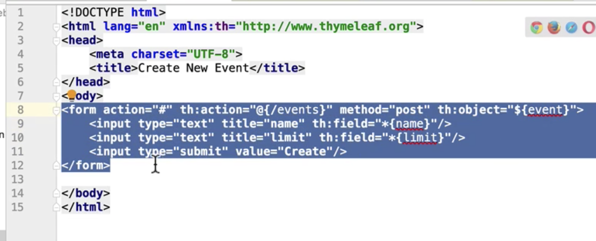

# 폼 서브밋 **(**타임리프**)**

#### 폼을 보여줄 요청 처리

- GET /events/form

- 뷰: events/form.html

- 모델: “event”, new Event() 

  - 이 이벤트 객체가 HTML로 보여줄 form을 채워줄 form making object이다.

  ```java
  @Controller
  public class SampleController{
    @GetMapping("/events/form")
    public String eventsForm(Model model){
      Event newEvent = new Event();
      newEvent.setLimit(50);
      model.addAttribute("event", new Event());
      return "events/form";
    }
    
    @PostMapping("/events")
    @ResponsBody
    public Event getEvent(@RequestParm String name,
                          @RequestParm Integer limit){
      Event event = new Event();
      event.setName(name);
      event.setLimit(limit);
      return event;
    } 
  }
  
  ```

```java
@Test
public void deleteEvent() throws Exception {
  mockMvc.perform(post("/events")
                  .param("name", "jungwoo")
                  .param("limit", 20))
    .andDo(print())
    .andExpect(status().isOk())
    .andExpect(jsonPath("name").value("jungwoo"));
    
}
```


#### 타임리프

- @{}: URL 표현식
- ${}: variable 표현식
- *{}: selection 표현식



위와 같이 form이 만들어졌음.

@{/events}은 /events라는 링크를 만들어 주는 것

${event}은 event라는 객체를 참조

*{name} : event라는 객체를 가지고 있는 것 중에 name을 셀렉션 해서 필드에 표현.


- events/form으로 요청이 들어오면 위에서 작성한 form.html 뷰를 보여줄 것이고 form 서브밋으로  저 form 데이터가 /events로 간다. 즉 @PostMapping("/events")로 갈 것이다. 
- form에 들어있던 name, limit을 getEvent 핸들러가 데이터를 받아 사용할 것이다.
- Test에서 작성했던 param이 쿼리 매개변수, 폼 데이터도 된다는 것을 알 수 있다.


#### 참고

- https://www.thymeleaf.org/doc/articles/standarddialect5minutes.html
- https://www.getpostman.com/downloads/