# 폼 서브밋 **(**에러 처리**)**

#### 바인딩 에러 발생 시 Model에 담기는 정보

- Event
- BindingResult.event

#### 타임리프 사용시 바인딩 에러 보여주기

- https://www.thymeleaf.org/doc/tutorials/2.1/thymeleafspring.html#field-errors 

  ```
  <p th:if="${#fields.hasErrors('limit')}" th:errors="*{limit}">Incorrect date</p>
  ```

  

  

#### Post / Redirect / Get 패턴

- https://en.wikipedia.org/wiki/Post/Redirect/Get
- Post 이후에 브라우저를 리프래시 하더라도 폼 서브밋이 발생하지 않도록 하는 패턴

#### 타임리프 목록 보여주기

● https://www.thymeleaf.org/doc/tutorials/2.1/thymeleafspring.html#listing-seed-starter-data

```
<a th:href="@{/events/form}">Create New Event</a> <div th:unless="${#lists.isEmpty(eventList)}">
<ul th:each="event: ${eventList}">
<p th:text="${event.Name}">Event Name</p>
</ul> </div>
```


바인딩 에러를 보여주기 위해서 아래와 같이 에러가 있을 시 뷰를 form을 보여주도록 한다.


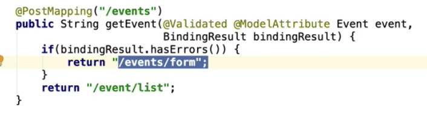


테스트에서 모델 사이즈를 프린트 하도록 설정하고

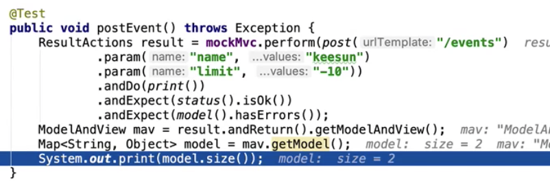

디버그 모드로 실행하면 모델 갯수가 두개를 보여준다. 하나는 event이다. event은 아래 html코드에서 객체를 event모드로 하였기에 클라이언트가 입력한 값이 event가 모델에 담겨있고

나머지 하나는 BindingResult이다.


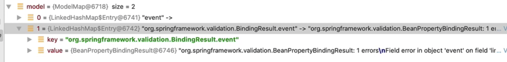


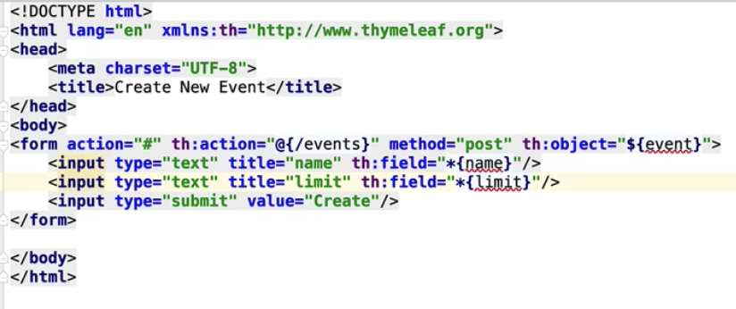


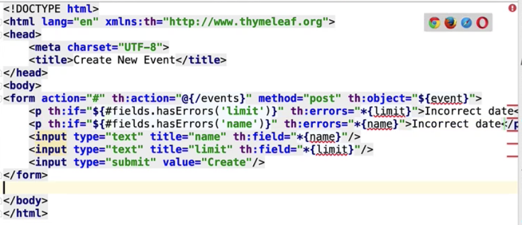

에러 메시지를 보여주기 위해서 위와 같이 html을 설정한다.


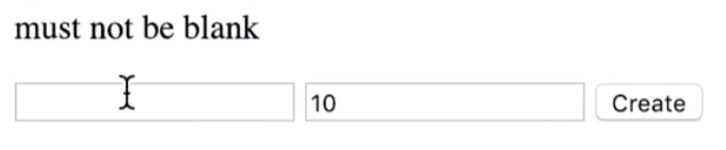


그 결과 에러메시지 처리가 잘 된 것을 알 수가 있다.

이 외에도 다양한 에러처리 메시지를 띄울 수 있다. 그것은 타임리프 문서에서 보면 알 수가 있다.


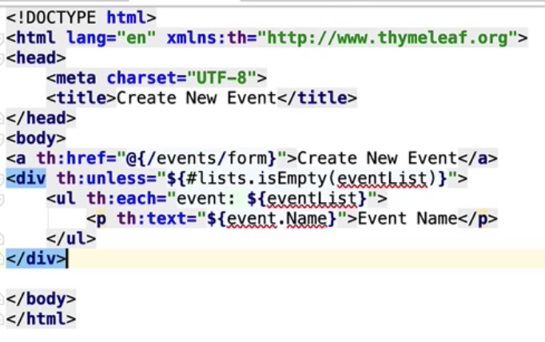

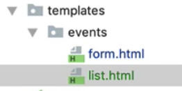

list.html을 추가해준다.


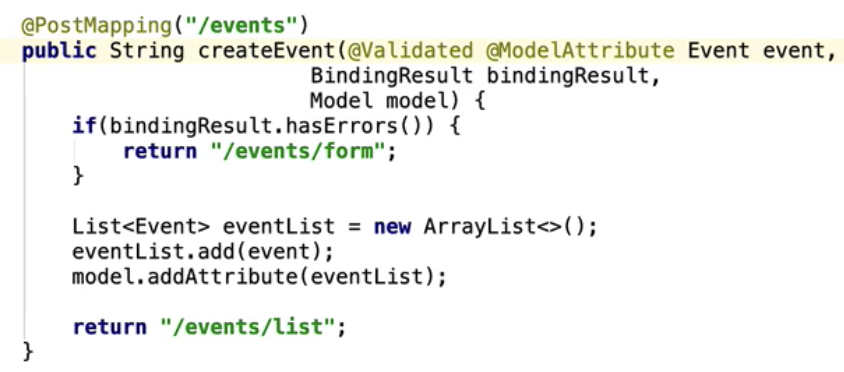

 우리가 repository가 있다면 repository에 저장을 한 다음 html에서 repository에 저장된 정보를 꺼내와서 사용자에게 보여줄 수 있게 짤 수 있지만

지금은 repository가 없기에 리스트에  event를 담아서 모델에 넣는다. 그래서 event의 리스트를 보여준다.

그렇지만 이렇게 짠다면 브라우저에서 리스트 목록을 갱신(get)하기 위해서 리프레쉬를 하면 post요청이 된다.

그래서 우리는 post/redirect/get패턴을 사용한다.

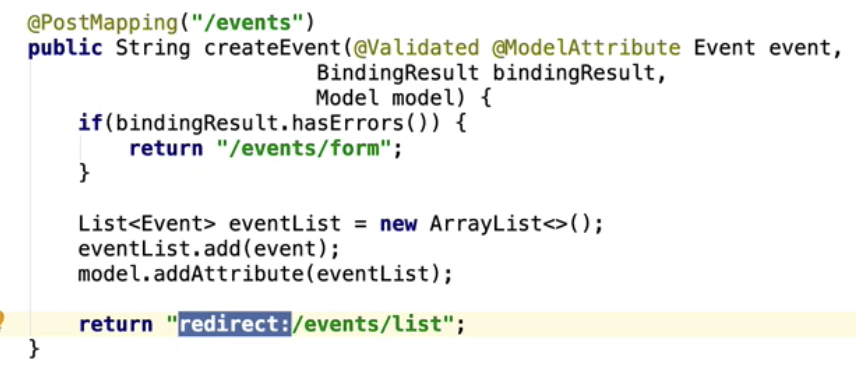

이런 식으로 짤 수도 있고


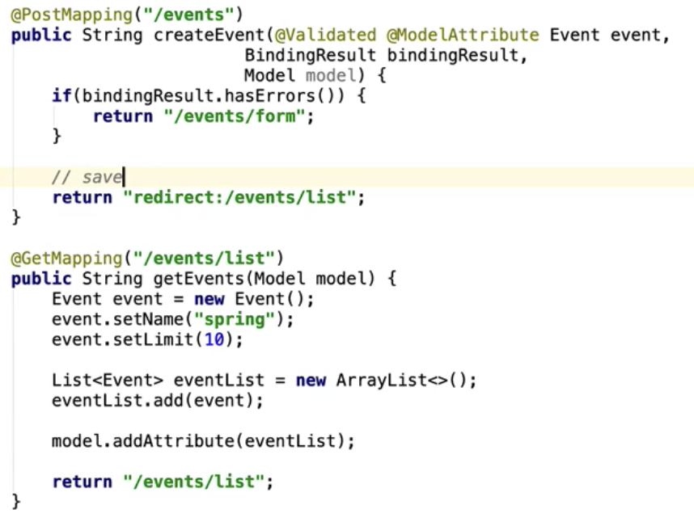

이런 식으로 짤 수 있다. //save부분은 db에 저장하는 부분.

