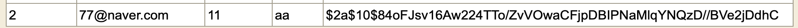

회원가입에는 비밀번호는 필수적이다.

비밀번호를 DB에 저장할텐데 비밀번호 자체 그대로 저장한다면 보안상의 문제가 발생할 수 있다.

그러기에 인코딩을하여 DB에 저장해야한다.

아주 편하게 Spring Security에서 단방향 암호화를 지원하는 `PasswordEncoder` 인터페이스와 구현체들을 제공한다.

해시 함수를 사용한는데 총 4가지 방식으로 암호화한다.

`Bcrypt`, `Argon2`, `pbkdf2`, `SCrypt` 방식들이 존재한다.

```java
public interface PasswordEncoder {
    String encode(CharSequence var1);

    boolean matches(CharSequence var1, String var2);

    default boolean upgradeEncoding(String encodedPassword) {
        return false;
    }
}

```

또한 핵심적인 메서드는 encode(), matches가 있다.

encode()는 raw 비밀번호를 암호화하는 메소드이고 matches는 raw한 비밀먼호와 암호환 비밀번호가 일치하는지 true, false로 알려준다.


```java
 @Bean
    public PasswordEncoder passwordEncoder() {
        return new BCryptPasswordEncoder();
    }
```

우선 전 Security Config파일에 PasswordEncoder를 빈으로 등록한다.


MemberController.class

```java
@PostMapping("/register")
public String userRegister(@ModelAttribute @Validated RegisterForm registerForm) {
	Member newMember = new Member(registerForm.getNickname(), registerForm.getName(), registerForm.getPassword(), registerForm.getEmail(), "MEMBER");
        memberService.createUser(newMember);

        return "redirect:/";
    }

@Data
@AllArgsConstructor
static class RegisterForm {

  @NotBlank(message = "닉네임을 입력해 주세요")
  @Size(min = 5, max = 15, message = "닉네임은 최소 {min}, 최대 {max}글자를 입력해주세요")
  private String nickname;

  @NotBlank(message = "패스워드를 입력하세요")
  private String password;

  @NotBlank(message = "이름을 입력하세요")
  @Size(min = 1, max = 10, message = "이름은 최소 {min}, 최대 {max}글자를 입력해주세요")
  private String name;

  @Email(message = "이메일 양식에 맞춰서 입력해주세요")
  @NotBlank(message = "이메일을 입력해주세요")//@Email이 null도 허용
  private String email;


  //@Pattern(regexp = "(01[016789])(\\d{3,4})(\\d{4})", message = "올바른 휴대폰 번호를 입력해주세요.")
  //핸드폰 번호

}
```

권한에 `MEMBER`라고만 저장을 하여도 security에 의해서 `ROLE_MEMBER`로 저장된다.


MemberService.class

```java
@Service
@Slf4j
@RequiredArgsConstructor
public class MemberService {

    private final MemberRepository memberRepository;

    private final PasswordEncoder passwordEncoder;

    @Transactional
    public void createUser(Member member) {
        member.setRole("MEMBER");
        //password 암호화.
        String encodedPassword = passwordEncoder.encode(member.getPassword());
        member.setPassword(encodedPassword);
        memberRepository.save(member);
    }
    
}
```


Security Config에서 PasswrodEncoder를 빈으로 등록하였기에 서비스단에서 주입을 받아 암호화 인코딩을한다.

인코딩을 한 상태로 저장을하면 된다.


