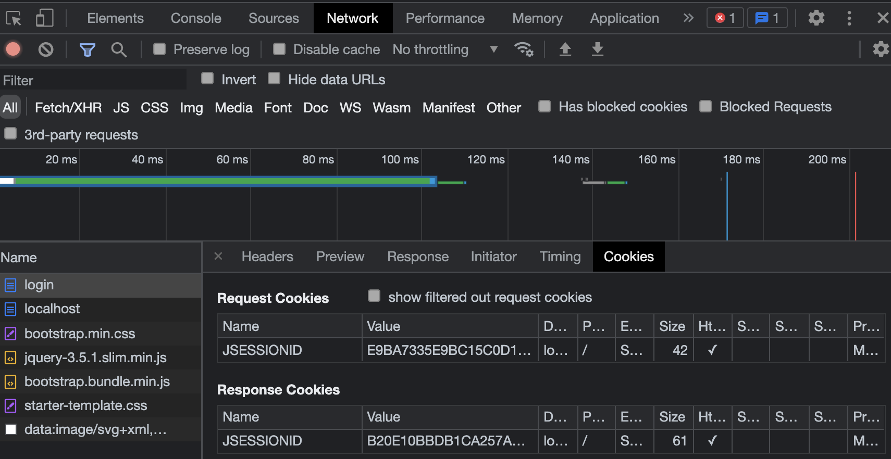
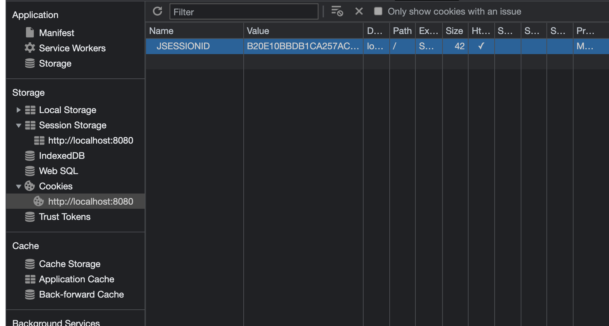

## 1. 세션

기본적으로 스프링 시큐리티는 **쿠키-세션 방식**을 사용한다. 대략적으로 설명하자면 클라이언트가 /login 요청을하여 로그인을 한다면 key-value로 spring security의 인메모리 세션저장소인 SecurityContextHolder에 저장한다. 로그인id가 value로 들어가고 랜덤한 값이 SessionId(key)에 들어간다.

서버에서 로그인이 정상적으로 된다면 응답 메시지에 set-cookie에 SessionId를 넣어서 보내준다.

클라이언트는 SessionId를 가지고 있는 쿠키를 브라우저에 있는 쿠키 저장소에 저장한다. 그 다음 클라이언트가 새로운 요청을 한다면 요청 Http에 SessionId를 포함한 값을 같이 보낸다. 

그러면 서버는 db에 저장되어있는 SessionId를 가지고 인증을 한 후에 응답을 한다.



위 스크린 샷은 로그인 성공한 응답을 받은 후의 모습이다. Request Cookies에 value값이 E9~이지만 로그인 인증 후에는 응답에 유저에 해당하는 랜덤한 SessionId값이 주어진 것을 알 수 있다.




위 스크린샷은 브라우저의 저장소를 보면 쿠키 저장소에 JSESSIONID값이 위에 응답 쿠키 value랑 같은 것을 알 수 있다.


쿠키-세션 방식의 장점은 서버쪽에서 Session 관리를 할 수 있으며 네트워크 부하가 적다는 것이 장점이다. 단점으로는 세션 저장소를 사용함으로써 서버에 부하가 간다는 것이다.


```java
@Service
@AllArgsConstructor
public class CustomUserDetailsService implements UserDetailsService {

    private final MemberRepository memberRepository;


    @Override
    public UserDetails loadUserByUsername(String email) throws UsernameNotFoundException {
        Optional<Member> memberEntityWrapper = memberRepository.findByEmail(email);
        Member member = memberEntityWrapper.get();


        List<GrantedAuthority> authorities = new ArrayList<>();
        authorities.add(new SimpleGrantedAuthority("ROLE_"+member.getRole()));


        return new MemberAccount(member, authorities);
    }

}
```

`UserDetailsService`은 DB에서 유저에 대한 정보를 가져오는 역할을 하는 인터페이스이다.

상속을 받아서 `loadUserByUsername`을 override하여 커스텀하여 유저 정보를 가져온다.

매개변수는 내가 원하는 것으로 변경하면 된다. 이메일로 로그인한다면 이메일 정보를 통하여 유저를 찾으면 된다.


## 2. AuthenticationManagerBuilder

`AuthenticationManagerBuilder` 클래스를 통해 인증 객체를 만들 수 있다. 

Security Confing class

```java
@Override
    protected void configure(AuthenticationManagerBuilder auth) throws Exception {
        auth.userDetailsService(customUserDetailsService).passwordEncoder(passwordEncoder());
    }
```

`AuthenticationManagerBuilder`을 파라미터로 가지는 configure를 오버라이드한다. `AuthenticationManagerBuilder`은 시큐리티의 인증에 대한 지원을 설정하는 여러개의 메소드를 가지고 있습니다.

그 중 `userDetailsService()`메소드를 사용해 `UserDetailsService` 인터페이스를 상속받아서 만든 클래스를 사용해 인증 객체를 만든다.


## 3. UserDetailsService

`UserDetailsService`는 인터페이스로 유저의 정보를 가져오는 인터페이스이다. 인터페이스를 오버라이드해서 구현해야 하는 메소드는 `loadUserByUsername`이다. 리턴 타입은 `UserDetails`로 사용자의 정보를 담는 인터페이스이다. 물론 UserDetails를 구현체를 직접 구현해야한다.


CustomUserDetailsService.class

```java
@Service
@AllArgsConstructor
public class CustomUserDetailsService implements UserDetailsService {

    private final MemberRepository memberRepository;


    @Override
    public UserDetails loadUserByUsername(String email) throws UsernameNotFoundException {
        Member member = memberRepository
                .findByEmail(email)
                .orElseThrow(() -> new UsernameNotFoundException("not found email : "+ email));


        List<GrantedAuthority> authorities = new ArrayList<>();
        authorities.add(new SimpleGrantedAuthority("ROLE_"+member.getRole()));


        return new MemberAccount(member, authorities);
    }
```


나는 email로 로그인을하고 인증을 확인할 것이기 때문에 파라미터를 email로 변경하였다. `List<GrantedAuthority> authorities`는 해당하는 유저의 권한정보를 담는 것이다.


## 4. UserDetails

`UserDetails`는 위에 설명했던 대로 사용자의 정보를 담는 인터페이스이므로 직접 구현해야한다.


MemberAccount.class

```java
public class MemberAccount extends User {
    private final Member member;
    public MemberAccount(Member member, Collection<? extends GrantedAuthority> authorities) {
        super(member.getEmail(), member.getPassword(), authorities);//첫번째 인자에 따라서 principal.getName()이 달라진다.
        this.member = member;
    }

    public Member getMember() {
        return member;
    }

}
```


`UserDetails`를 직접 상속받아 username, password를 직접 구현해도 되지만 이미 `User`라는 클래스를 제공한다.

`User`클래스는 `UserDetails` 인터페이스 구현체이므로 그냥 상속ㅂ다아서 사용만 하면 된다. 